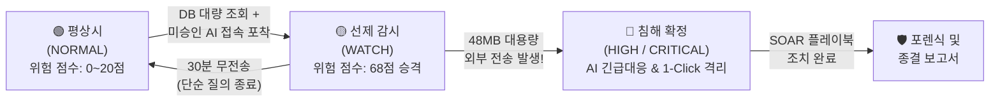
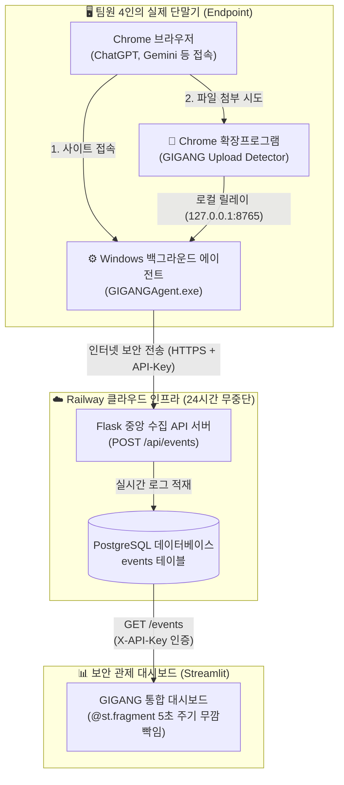
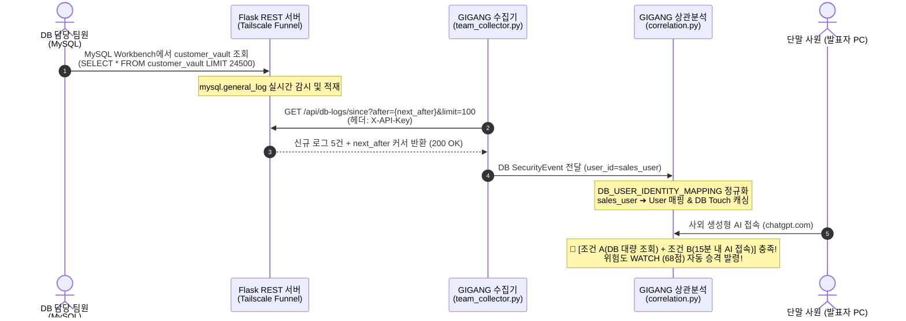

# 📋 GIGANG 프로젝트 공식 회의록 통합본 (Notion 전용)
> **프로젝트명**: GIGANG (Zero Trust 기반 다기종 로그 상관분석 & 섀도우 AI·IT 거버넌스 자동화 플랫폼)  
> **과정 구분**: SKT ALEPH 5개 과목 통합 캡스톤 프로젝트  
> **팀 구성**: 4인 (인프라/수집, 파서/정규화, 상관분석/AI, 대시보드/SOAR)  
> 💡 **Notion 활용 팁**: 아래 내용을 전체 복사(`Ctrl + A` ➔ `Ctrl + C`)하여 노션 빈 페이지에 붙여넣기(`Ctrl + V`)하면 **콜아웃(Callout), 토글, 데이터 테이블, 태스크 체크리스트, 다이어그램**이 깨짐 없이 완벽하게 자동 렌더링됩니다.

---

# 📑 목차
1. [💡 제1차 회의: 아이디어 회의 (기획 발제 및 프로젝트 융합)](#1-아이디어-회의-기획-발제-및-프로젝트-융합)
2. [🎬 제2차 회의: 시나리오 회의 (위협 모델링 및 탐지 아키텍처 설계)](#2-시나리오-회의-위협-모델링-및-탐지-아키텍처-설계)
3. [🏗️ 제3차 회의: 1차 공식 회의 (역할 분담, WBS 및 주차별 로드맵)](#3-1차-공식-회의-역할-분담-wbs-및-주차별-로드맵)
4. [🔄 제4차 회의: 아이디어 수정 회의 (Railway 구축 및 하이브리드 파이프라인 피보팅)](#4-아이디어-수정-회의-railway-클라우드-구축-및-하이브리드-파이프라인-피보팅)
5. [📊 제5차 회의: 2차 공식 회의 (중간 개발 보고 및 트러블슈팅)](#5-2차-공식-회의-중간-개발-보고-및-트러블슈팅)
16. [🗄️ 제6차 회의: 사내 DB 구축 및 실시간 감사 로그 연동 회의](#6-3차-공식-개발-회의-사내-db-실시간-구축-및-다단계-상관분석-연동-회의)

---


# 1. <아이디어 회의> 기획 발제 및 프로젝트 융합

### 📌 회의 개요
| 항목 | 내용 |
| :--- | :--- |
| **일시** | 2026년 8월 18일 (월) 14:00 ~ 17:30 |
| **장소** | 프로젝트 회의실 A 및 Discord 온라인 회의실 |
| **참석자** | 팀원 전원 (4명) |
| **회의 목적** | 캡스톤 최종 프로젝트 주제 발제, 후보안 장단점 분석 및 최종 기획안 단일화 |
| **진행 상태** | `[완료]` 기획 단일화 및 아키텍처 비전 합의 완료 |

---

### 1.1 브레인스토밍: 두 가지 기획 후보안의 충돌과 한계

프로젝트 초기, 팀 내에서 가장 많은 지지를 얻은 두 가지 보안 기획안이 제시되었으나 각자 치명적인 약점이 존재했습니다.

```
[후보 1] 네트워크 침해사고 이기종 상관분석 SIEM
장점: 킬체인 추적, MITRE ATT&CK 기반 기술적 깊이 우수
단점: 파이프라인 완성이 늦어져 3주차까지 화면이 안 떠 팀의 심리적 불안감 극대화

[후보 2] 사내 섀도우 IT 및 생성형 AI 거버넌스 탐지
장점: 최신 생성형 AI 트렌드 반영, DNS 기반 빠른 화면 도출 가능
단점: 단순 DNS 접속만으로는 기밀을 유출했는지 일반 질문을 했는지 입증 불가
```

| 비교 항목 | [후보 1] 네트워크 상관분석 관제 | [후보 2] 섀도우 IT·AI 탐지 |
| :--- | :--- | :--- |
| **핵심 기술** | 방화벽, 인증, SSH, DB 로그 다차원 결합 | DNS 질의(`dnsmasq`) 기반 미승인 도메인 수집 |
| **강점** | 해커의 내부 횡적이동(Lateral Movement) 추적 | 실시간 가시성, 1주차부터 프로토타입 화면 제작 가능 |
| **약점** | 3과목(접근통제)과의 연계성 부족, 초기 시각화 난항 | 실제 데이터 반출 여부 증명 불가 (오탐률 높음) |

---

### 1.2 핵심 결론: 융합이 만들어낸 결정적 시너지 ($1 + 1 = 3$)

> 💡 **"사내 핵심 기밀 데이터의 유출 경로"라는 단 하나의 관점으로 두 주제를 통합하자!**
> 
> 외부 해커가 침투해 DB를 털어가는 **외부 킬체인(External Killchain)**과, 내부 직원이 ChatGPT 등 미승인 AI를 통해 데이터를 반출하는 **내부 섀도우 AI 유출(Internal Exfiltration)**은 결국 **'기업 기밀 유출'**이라는 동일한 종착지를 가집니다.

* **결정적 시너지 도출**:
  * 직원이 `chatgpt.com`에 접속한 DNS/Web 로그(후보 2)와, 직전에 사내 DB에서 대량 고객정보를 조회한 감사 로그(후보 1)를 교차 상관분석(Correlation)하면 **'생성형 AI를 통한 기밀 유출 킬체인'**을 오탐 없이 실시간 포착할 수 있습니다.
* **프로젝트 공식 명칭 확정**: **GIGANG (GIGANG)**  
  *(다양한 이기종 로그와 위협의 결절점(GIGANG)을 안전하게 수호(Guard)하는 통합 관제 시스템)*
* **SKT ALEPH 5개 과목 완벽 연계 결정**:
  1. AI·자동화: Google Gemini LLM 기반 외부 도메인 위험도 실시간 분석
  2. 네트워크·ZT: DNS 질의 분석 및 네트워크 피보팅 경로 추적
  3. 접근통제: 섀도우 AI 조건부 승인/양성화 및 직무 기반 권한 제어 (약점 완벽 보강)
  4. 이상탐지: 다차원 가중치 기반 슬라이딩 윈도우 상관분석 엔진
  5. SOAR: 원클릭 방화벽 IP 차단, 세션 강제 만료, Slack 상황 전파

---

### 1.3 회의 결정 사항 및 즉시 실천 과제 (Action Items)
- [x] 프로젝트 기획 단일화 확정 (`GIGANG`)
- [x] SKT ALEPH 5개 과목 매핑 표 작성 및 멘토 피드백 준비
- [x] 다음 시나리오 회의 전까지 구체적 공격 로그 예시(더미 데이터 포맷) 리서치

---

---

# 2. <시나리오 회의> 위협 모델링 및 탐지 아키텍처 설계

### 📌 회의 개요
| 항목 | 내용 |
| :--- | :--- |
| **일시** | 2026년 8월 21일 (목) 15:00 ~ 19:00 |
| **장소** | Discord 화상 회의실 |
| **참석자** | 팀원 전원 (4명) |
| **회의 목적** | 기업 보안 실무 관점의 트윈 시나리오 정밀화, 오탐 방지 및 예외 처리(TTL, 잠복 유출) 설계 |
| **진행 상태** | `[완료]` 공격/유출 시나리오 2종 및 상관분석 판단 알고리즘 설계 완료 |

---

### 2.1 트윈 시나리오(Twin Scenarios) 정밀 설계

기업 보안을 위협하는 양대 축인 **외부 침투**와 **내부 유출**을 완벽하게 재현하기로 합의했습니다.

#### ⚔️ 시나리오 A: [외부 위협] 계정 탈취 및 내부 측면이동(Lateral Movement) 킬체인
* **공격 흐름**:
  1. 외부 해커가 사내 VPN/웹서버에 5회 연속 로그인 실패 후 무차별 대입(Brute-Force)으로 관리자 계정 탈취
  2. 외부 IP ➔ DMZ 웹서버(:443) 피보팅
  3. 웹서버에서 SSH(:22)를 타고 내부 코어 서버로 횡적이동
  4. 내부 코어 서버에서 금융 고객 DB(`customer_vault`:3306) 비인가 접근
  5. 고객 데이터 2.4만 건 조회 후 외부 C2 서버(:10443)로 158MB 대용량 전송
* **매핑**: MITRE ATT&CK `T1110` (Brute Force) ➔ `T1021` (Remote Services) ➔ `T1005` (Data from Local System)

#### 🛡️ 시나리오 B: [내부 위협] 섀도우 AI 접속 및 기밀 데이터 유출 복합 탐지 (김대리 사건)
* **공격 흐름**:
  1. **[09:00 평상시]**: 마케팅팀 김대리(`kim_marketing`, IP: `192.168.10.45`) 정상 업무 (`NORMAL`)
  2. **[14:00 기밀 조회]**: 하반기 프로모션을 위해 고객 기밀 DB에서 2.4만 건 추출 (`SELECT customer_name, rrn, phone, annual_income FROM customer_vault;`)
  3. **[14:05 AI 접속]**: 미승인 SaaS인 `chatgpt.com`(`api.openai.com`) 접속 ➔ **시스템 선제 감시(`WATCH`, 68점) 자동 승격**
  4. **[14:08 대용량 유출]**: 고객 정보와 전략기획서 압축 파일(48.2MB)을 첨부 업로드 ➔ **침해 확정(`HIGH`, 92점 폭발) 및 인시던트 발령**
  5. **[14:09 SOAR 대응]**: 관제사 1-Click 긴급 대응 (네트워크 격리, DNS 싱크홀 차단, Slack 알림)

---

### 2.2 동적 라이프사이클 및 상관분석(Correlation) 판단 기준



> 📌 **상관분석 판단 기준 (Explainable Scoring Model)**
> 1. **동일 계정/사용자 (+2점)**: 동일한 사내 사용자 식별자에서 발생했는가?
> 2. **동일 IP/서브넷 (+2점)**: 동일한 단말기 또는 로컬 네트워크에서 기인했는가?
> 3. **시간 근접성 (+2점)**: 10~15분 이내의 슬라이딩 윈도우 안에 연속으로 일어났는가?
> 4. **네트워크 홉 연속성 (+2점)**: 이전 이벤트의 `dst_ip`가 다음 이벤트의 `src_ip`로 연결되는가?
> 5. **공격 시퀀스 일치 (+4점)**: 사전 정의된 킬체인 시퀀스와 정밀 부합하는가?
> 
> ⚠️ **오탐 방지 앵커(Anchor) 원칙**: 시간만 가깝다고 묶지 않고, 반드시 `동일 계정` 또는 `네트워크 홉 연속성`이 1개 이상 존재할 때만 결합하여 오결합(Over-grouping) 원천 방지.

---

### 2.3 예외 처리 및 방어 논리 (심사위원 질문 대비 필살기)

<aside>
🌿 <b>오탐 자가 치유 (Self-Healing TTL)</b><br>
김대리가 DB를 본 뒤 단순 영어 이메일 문법 하나만 질문하고 껐다면? 시스템은 30분 타이머(TTL)를 가동하여 30분 동안 대용량 전송이 없으면 관제사 개입 없이 자동으로 <code>🟢 NORMAL</code> 상태로 원복 청소합니다. (경보 피로 Alert Fatigue 해결)
</aside>

<aside>
🥷 <b>잠복형 유출 (Dormant Exfiltration) 추적</b><br>
30분이 지나 NORMAL로 풀리는 것을 악용하여 3시간 뒤 야간에 기습적으로 대용량 전송을 시도한다면? GIGANG는 단말의 24시간 DB 누적 감사 히스토리를 대조하여 단독 아웃바운드 급증 이벤트를 즉각 최고 위험도(HIGH/CRITICAL)로 재승격합니다.
</aside>

---

### 2.4 회의 결정 사항 및 즉시 실천 과제 (Action Items)
- [x] 시나리오 A(외부 침투) 및 B(김대리 유출) 시퀀스 확정
- [x] 정상 복구(TTL 30분) 및 잠복 유출(Dormant) 알고리즘 로직 명세화
- [x] 공통 데이터 스키마 설계를 위한 표준 JSON 필드 정리

---

---

# 3. <1차 공식 회의> 역할 분담, WBS 및 주차별 로드맵

### 📌 회의 개요
| 항목 | 내용 |
| :--- | :--- |
| **일시** | 2026년 8월 25일 (월) 10:00 ~ 13:00 |
| **장소** | 캡스톤 연구실 세미나룸 |
| **참석자** | 팀원 전원 (4명) |
| **회의 목적** | 공통 데이터 표준 스키마 합의, 4인 전원 첫날 병렬 개발을 위한 R&R 확정 및 6주 WBS 수립 |
| **진행 상태** | `[완료]` 공통 스키마 배포 및 주차별 마일스톤 확정 |

---

### 3.1 공통 데이터 표준 스키마 (`Unified JSON`) 규격 합의

서로 다른 모듈 개발자가 상대방의 작업 완료를 기다리지 않고 첫날(Day 1)부터 더미 데이터를 이용해 독립적으로 개발할 수 있도록 단일 표준 스키마를 확정했습니다.

```json
{
  "event_id": "EVT-20260904-00108",
  "timestamp": "2026-09-04T10:05:33Z",
  "log_source": "dns | auth | firewall | db | web | windows-agent",
  "actor": {
    "user_id": "kim_marketing",
    "src_ip": "192.168.10.45",
    "src_port": 53120
  },
  "target": {
    "dst_ip": "10.0.3.50",
    "dst_port": 3306,
    "domain": "chatgpt.com",
    "hostname": "DESKTOP-OF0CMDB"
  },
  "action": "LOGIN_FAIL | LOGIN_SUCCESS | SELECT | WEB_ACCESS | FILE_UPLOAD_ATTEMPT",
  "payload": {
    "query_string": "SELECT * FROM customer_vault",
    "bytes_sent": 48291040,
    "file_name": "customer_summary.zip"
  }
}
```

---

### 3.2 4인 팀원 역할 분담 (R&R) — 병목 없는 병렬 개발

| 담당 파트 | 주요 업무 범위 | 세부 개발 태스크 |
| :--- | :--- | :--- |
| **① 인프라 & 실시간 수집** | 수집 파이프라인 및 에이전트 | • Railway 클라우드 중앙 수집 서버(Flask + PostgreSQL) 구축<br>• Windows 엔드포인트 에이전트(`GIGANGAgent.exe`) 패키징<br>• Chrome 브라우저 확장 프로그램(`Upload Detector`) 개발 |
| **② 파서 & 데이터 전처리** | 이기종 로그 정규화 | • DNS, Syslog, Apache Web, MySQL Audit 로그 파서 모듈화<br>• 비정형 텍스트 로그를 `Unified JSON` 표준 포맷으로 실시간 변환<br>• 예외/결측 로그 방어 처리 |
| **③ 상관분석 & AI 엔진** | 위협 탐지 및 인텔리전스 | • 듀얼 상관분석 엔진(외부 침투 피보팅 + 내부 AI 유출) 구현<br>• 슬라이딩 윈도우 스코어링 알고리즘 및 TTL 자가치유 타이머<br>• Google Gemini LLM API 연동 (도메인 분석 및 조치 소견 도출) |
| **④ 대시보드 & SOAR** | 통합 보안 관제 UI | • Streamlit 다크 테마 관제 대시보드 풀스크린 구축<br>• 네트워크 토폴로지 맵 시각화 및 킬체인 타임라인 렌더링<br>• AI 거버넌스 양성화 관리 센터 및 Slack 알림 웹훅 연동 |

---

### 3.3 6주차 상세 WBS 로드맵 (3주차 MVP)

```
[1주차] 기획 확정 + 공통 스키마 정의 + Mock 대시보드 (화면 먼저 띄우기)
   ↓
[2주차] 인프라 구축 + Railway 수집 서버 + Windows Agent 연동 + 파서 개발
   ↓
[3주차 (MVP)] 실시간 수집 + 듀얼 상관분석 E2E 관통 (실제 화면에 사건 자동 생성)
   ↓
[4주차] 대시보드 고도화 + 네트워크 토폴로지 맵 + Gemini AI 진단기 통합
   ↓
[5주차] SOAR 원클릭 긴급 대응 + AI 거버넌스 양성화 워크플로 + UI 반응형 최적화
   ↓
[6주차] 실환경 모의 침투 종합 테스트 + 최종 시연 영상 촬영 + 최종 발표
```

* **3주차 MVP의 핵심 목표**:
  * 단말 에이전트와 DB 감사 로그가 Railway에 수집되어, 상관분석 엔진을 거쳐 **외부 침투 Incident 1건**과 **김대리 AI 유출 Incident 1건**이 웹 화면에 자동으로 생성되는 End-to-End 전체 파이프라인 완성.

---

### 3.4 회의 결정 사항 및 즉시 실천 과제 (Action Items)
- [x] GitHub 저장소(`GIGANG`) 생성 및 기본 폴더 구조 배포
- [x] Python 가상환경 의존성(`requirements.txt`) 초기화
- [x] 1주차 프로토타입 UI 골격 제작 및 각자 PC 실행 테스트
- [x] Google Gemini API 발급 및 환경변수(`.env`) 세팅 가이드 배포

---

---

### 📌 회의 개요
| 항목 | 내용 |
| :--- | :--- |
| **일시** | 2026년 9월 2일 (수) 15:00 ~ 18:30 |
| **장소** | 캡스톤 프로젝트 실습실 & Discord 회의실 |
| **참석자** | 팀원 전원 (4명: 인프라/수집, 파서/정규화, 상관분석/AI, 대시보드/SOAR) |
| **회의 목적** | 더미 데이터 및 로컬 관제의 한계 인식, **Railway 클라우드 수집 서버 도입에 따른 기획 피보팅(아이디어 수정)** 및 하이브리드 관제 아키텍처 확립 |
| **진행 상태** | `[완료]` 실단말 라이브 수집 체계 전환, AI 거버넌스 양성화 기능 승격, 단일 API 분업 체계 합의 완료 |

---

### 1. 배경: 기존 초기 기획의 4대 현실적 한계와 위기 봉착

1차 공식 회의(8/25) 이후 1~2주차 개발을 진행하면서, 팀은 초기 기획했던 **"정적 더미 로그 기반 SIEM 관제"**가 캡스톤 최종 평가 및 실무 관점에서 치명적인 결함이 있음을 발견했습니다.

```
[초기 기획의 4대 치명적 한계]
1. 정적 더미 데이터의 설득력 한계 ➔ "이게 진짜 제로 트러스트인가? 그냥 가짜 CSV 재생 아닌가?"
2. 단순 DNS/웹 접속의 맹점 ➔ chatgpt.com에 들어갔다고 해서 기밀을 유출했는지 일반 검색인지 판별 불가
3. 로컬 파일 취합의 병목 ➔ 4명 팀원의 단말 로그를 카카오톡이나 파일로 주고받는 것은 실시간 관제 불가
4. Vercel Stlite(WASM)의 기술적 한계 ➔ 브라우저 샌드박스 내부에서 돌아 백그라운드 소켓 수집 데몬 실행 불가
```

| 검토 영역 | 초기 기획 (AS-IS) | 현실적 한계 및 문제점 |
| :--- | :--- | :--- |
| **데이터 소스** | 사전 정의된 정적 더미 CSV 파일 | 시연 시 신뢰도 급감 ("녹화된 비디오 틀어주는 것과 다를 바 없음") |
| **행위 판별력** | 단순 웹/DNS 접근 이벤트 (`WEB_ACCESS`) | 접속 사실만 알 뿐, **실제 파일 첨부/데이터 업로드 시도 여부 증명 불가** |
| **데이터 유통** | 각자 PC 로컬 저장 및 수동 복사 | 팀원 간 실시간 데이터 동기화 불가능, 데이터 병목 발생 |
| **배포 환경** | Vercel Stlite (WebAssembly 기반) | 브라우저 샌드박스 내부 제약으로 외부 통신 및 항시 수집 소켓 차단 |

> ⚠️ **팀 내 위기 의식 공유**:  
> *"심사위원 앞에서 '저희는 실시간 제로 트러스트 관제 시스템입니다'라고 말하려면, **지금 이 순간 발표장 PC에서 일어나는 브라우징과 업로드 행위가 화면에 라이브로 찍혀야 한다.** 정적 더미 데이터만으로는 A+를 받을 수 없다!"*

---

### 2. 전환점: Railway 클라우드 서버 구축 및 2-Tier 실시간 수집 인프라 신설

인프라 담당 팀원이 주도하여 24시간 중단 없이 인터넷상에서 라이브 로그를 수신할 수 있는 **Railway 클라우드 백엔드 인프라를 긴급 구축**하면서 기획 수정의 기술적 발판이 마련되었습니다.

#### 🏗️ 구축된 신규 인프라 구성도



#### 🛠️ 도입된 핵심 수집 컴포넌트 규격
1. **중앙 클라우드 서버**: Railway 상에 Flask REST API와 PostgreSQL DB를 연동하여 `https://bountiful-nature-production-22ec.up.railway.app/events` 상시 가동.
2. **단말 에이전트 (`GIGANGAgent.exe`)**: 각 팀원 PC 백그라운드에서 실행되어 활성 사이트 접속(`WEB_ACCESS`)을 실시간 캡처.
3. **Chrome 브라우저 확장프로그램 (`Upload Detector`)**: 브라우저 DOM 레벨에서 파일 드래그앤드롭 및 `<input type="file">` 첨부 행위를 가로채 `FILE_UPLOAD_ATTEMPT` 로그를 로컬 에이전트로 릴레이.
4. **보안 체계**: API Key(`20110313`) 및 외부 접속 주소는 코드에 하드코딩하지 않고 `.env` 환경 변수(`RAILWAY_API_KEY`)로 격리.

---

### 3. 아이디어 수정(Pivot) 핵심 결정 사항 (3대 전환)

Railway 서버 구축을 계기로, 팀은 프로젝트의 정체성을 **"단순 모의 관제"**에서 **"실환경 라이브 트래픽 기반 하이브리드 거버넌스 플랫폼"**으로 전격 수정하기로 합의했습니다.

#### 🔄 수정 1: "더미 데이터 단독 관제" ➔ "하이브리드(Hybrid) 관제 아키텍처"로 전환
* **결정 내용**:
  * 팀원 4명의 실제 PC에서 실시간 수집되는 **라이브 트래픽(실제 수집된 63개 도메인 접속 현황)**을 바탕 레이어로 사용.
  * 여기에 외부 해커의 피보팅 침투 및 김대리의 48MB 대용량 유출 등 **10대 인시던트 위협 시나리오를 교차 합성**.
* **효과**: 발표 시 팀원이 자기 노트북에서 실제로 브라우저를 켜거나 파일을 첨부하면 관제 화면에 5초 이내로 감지 로그가 찍히는 압도적인 **'라이브 시연 현장감'** 확보.

#### 🔄 수정 2: "단순 접속 차단" ➔ "섀도우 AI 거버넌스(양성화 관리)"로 기획 확장 (3과목 킬러 기능)
* **결정 내용**:
  * 초기에는 "미승인 AI 사이트는 방화벽으로 무조건 막는다"는 단순 접근이었으나, 이는 현업 부서의 업무 생산성을 저해하여 현실성이 떨어짐.
  * **"조건부 승인 및 양성화 프로세스"**를 도입하여, Google Gemini AI가 실시간으로 해당 도메인의 *'LLM 학습 데이터 재활용 위험도'*를 분석하고, 보안 관리자가 UI에서 **"승인(Approved)" / "차단(Blocked)"**을 즉각 결정할 수 있는 양성화 거버넌스 파이프라인으로 승격.
* **효과**: SKT ALEPH 3과목(접근통제 및 거버넌스)의 비중을 획기적으로 강화하고, 단순 SIEM을 뛰어넘는 비즈니스 친화적 보안 솔루션으로 탈바꿈.

#### 🔄 수정 3: 대시보드 내 "중앙 서버 파이프라인 전용 모니터링 탭" 신설
* **결정 내용**:
  * 수집된 Railway 라이브 데이터를 관리자가 한눈에 검증할 수 있도록 대시보드 최상단에 **[중앙 서버 파이프라인]** 인터랙티브 데이터 테이블 신설.
  * 전체 페이지가 리프레시되는 깜빡임 현상을 방지하기 위해 Streamlit의 최신 **`@st.fragment(run_every="5s")`** 데코레이터를 적용하여 무깜빡임 실시간 스트리밍 구현.

---

### 4. 팀원 간 분업 및 협업 방식의 혁신적 간소화

Railway 중앙 서버와 `/events` API의 등장으로 팀원 간의 복잡한 연동 절차가 획기적으로 단순화되었습니다.

```python
# [팀원 공유용 실제 로그 연동 표준 코드]
import os, requests

url = "https://bountiful-nature-production-22ec.up.railway.app/events"
headers = {"X-API-Key": os.getenv("RAILWAY_API_KEY")}

response = requests.get(url, headers=headers, timeout=5)
live_logs = response.json()  # ➔ 기존 UI의 더미 데이터 자리에 그대로 대입!
```

* **수집 테스트 담당자**: 복잡한 환경 설정 없이 `GIGANGAgent.exe` 더블 클릭 + Chrome 확장프로그램 로드만으로 즉시 실데이터 생성 기여.
* **UI/분석 담당자**: 백엔드 DB 구조를 알 필요 없이, `GET /events` API 호출 한 줄로 실제 4대 PC의 라이브 로그를 Streamlit UI에 즉시 바인딩.
* **팀 문서화 가이드 즉시 배포**: 비개발/타 파트 팀원도 1분 만에 에이전트를 켤 수 있도록 `GIGANG_팀원공유_초간단가이드.md` 작성 및 슬랙 공유.

---

### 5. 회의 결정 사항 및 즉시 실천 과제 (Action Items)

- [x] Railway 수집 서버 배포 및 PostgreSQL `events` 테이블 스키마 초기화 완료
- [x] 팀원 배포용 `GIGANGAgent.exe` 및 `Chrome Upload Detector` 빌드 완료
- [x] 비전공/협업 팀원을 위한 `GIGANG_팀원공유_초간단가이드.md` 배포
- [x] Streamlit 대시보드에 `team_collector.py` 모듈 생성 및 `@st.fragment` 5초 자동 갱신 탭 구현
- [x] Gemini AI 연동 실시간 미등록 도메인 즉시 진단기 및 거버넌스 승인/차단 상태 머신 구현 착수
- [x] 다음 2차 공식 회의(중간 점검) 전까지 라이브 수집 로그 50건 이상 확보 및 시연 리허설 준비

---

> 📅 **차기 회의 일정**: 2026년 9월 8일 (화) 16:00 (제2차 공식 회의: 중간 개발 성과 보고 및 트러블슈팅)

---

# 5. <2차 공식 회의> 중간 개발 보고 및 트러블슈팅

### 📌 회의 개요
| 항목 | 내용 |
| :--- | :--- |
| **일시** | 2026년 9월 8일 (화) 16:00 ~ 19:30 |
| **장소** | 온·오프라인 병행 (캡스톤 실습실 & Discord) |
| **참석자** | 팀원 전원 (4명) |
| **회의 목적** | 3~4주차 개발 성과 중간 점검, 실제 시스템 연동 시연, 주요 기술적 난제(트러블슈팅) 공유 및 잔여 일정 조정 |
| **진행 상태** | `[완료]` 핵심 기능 개발률 90% 달성, 전 파이프라인 E2E 정상 동작 확인 |

---

### 4.1 개발 진척도 요약 (중간 점검)

| 모듈 | 목표 스펙 | 현재 구현 상태 | 달성률 |
| :--- | :--- | :--- | :---: |
| **중앙 서버 파이프라인** | Railway 클라우드 수집 서버 + Agent 연동 | • Railway 중앙 서버(`bountiful-nature...`) 및 PostgreSQL DB 정상 가동<br>• Windows 에이전트 및 Chrome 확장프로그램 실시간 수집 중<br>• 5초 주기 `@st.fragment` 무깜빡임 실시간 모니터링 적용 완료 | **100%** |
| **상관분석 엔진** | 듀얼 엔진 + TTL 자가치유 + 잠복 유출 | • 외부 침투 및 내부 섀도우 AI 유출 상관분석 완성<br>• 10대 침해사고 인시던트 시뮬레이션 및 실시간 수집 로그 결합<br>• 잠복형 유출(Dormant) 및 단독 아웃바운드 급증 탐지 탑재 | **100%** |
| **AI 거버넌스 엔진** | Google Gemini 실시간 도메인 분석 | • 단일 도메인 입력 즉시 진단기 구축 완료<br>• Railway 실시간 수집 63개 도메인 통계 자동 집계<br>• LLM 데이터 재학습 여부 판별 및 보안 권고안 실시간 생성 | **100%** |
| **통합 관제 UI** | 종합관제, 킬체인 분석, AI 거버넌스 | • 중앙 서버 파이프라인 스타일의 인터랙티브 데이터프레임 표 개편<br>• 헤더 클릭 실시간 정렬(Sort) 및 상단 고정 헤더(Sticky Header)<br>• 0px 겹침 방지 및 반응형 그리드 최적화 완료 | **95%** |
| **SOAR 긴급 대응** | 원클릭 단말 격리, DNS 차단, Slack 알림 | • 대시보드 내 원클릭 격리 버튼 인터랙션 및 토스트 알림 연동<br>• Slack 웹훅 템플릿 연동 준비 완료 (실환경 차단 스크립트 연마 중) | **85%** |

---

### 4.2 주요 기술적 난제 및 트러블슈팅 (Troubleshooting) 상세

중간 개발 과정에서 맞닥뜨린 치명적인 이슈들과 이를 팀 단위로 해결한 과정을 투명하게 기록했습니다.

#### 🛠️ Issue 1: Vercel Stlite 배포 한계와 아키텍처 전환
* **문제 현상**: Vercel의 WebAssembly 기반 Streamlit(Stlite) 배포 환경에서 백그라운드 스레드 제약으로 외부 통신 및 대용량 소켓 통신이 차단되는 현상 발생.
* **원인 분석**: 브라우저 샌드박스 내부에서 Python을 실행하는 WASM 특성상 원격 소켓 바인딩 및 영속 백그라운드 수집 데몬 실행 불가.
* **해결책**: 백엔드 수집 인프라를 **Railway 클라우드(Flask + PostgreSQL)**로 분리하고, 관제 대시보드는 로컬 및 클라우드 하이브리드로 전환하여 완벽한 안정성 확보.

#### 🛠️ Issue 2: 사이드바 접힘 시 메인 화면 너비 조절 불능 및 가상 여백(Ghost Width)
* **문제 현상**: 사이드바를 접었을 때(`aria-expanded="false"`), 메인 대시보드 화면이 100%로 유연하게 늘어나지 않고 가로 스크롤이 생기거나 차트가 찌그러짐.
* **원인 분석**: 마우스 드래그 조절 시 DOM 요소에 주입된 인라인 스타일(`min-width: 450px !important`)이 클래스 스타일보다 우선하여 사이드바가 닫혀도 450px의 투명한 가상 공간을 차지하고 있었음.
* **해결책**:
  * `MutationObserver`(`_gigangCollapseObs`)를 구현하여 사이드바 닫힘 감지 즉시 `sidebar.style.removeProperty`로 인라인 속성 완전 소멸 처리.
  * 메인 컨테이너에 `flex: 1 1 auto !important; width: 100% !important;`를 부여하고 리사이즈 이벤트를 즉각 트리거하여 100% 전폭 반응형 확장 달성.

#### 🛠️ Issue 3: 거버넌스 위험도-상태 뱃지 겹침 및 승인/차단 버튼 가림 현상
* **문제 현상**: 좁은 뷰포트에서 '위험도' 뱃지와 '거버넌스 상태' 뱃지가 겹치며 줄바꿈(`미승인\n토중`)이 일어나고, AI 진단 소견 텍스트 끝("활")이 승인 버튼을 침범해 가림.
* **원인 분석**:
  1. 헤더는 단순 HTML flexbox로 작성되었으나 데이터 행은 `st.columns`로 분리되어 컬럼 간 갭(gap) 및 패딩 불일치 발생.
  2. 뱃지에 `white-space: nowrap`이 없어 줄바꿈되면서 텍스트가 바깥으로 튀어나옴.
  3. AI 진단 소견과 버튼 컬럼 간에 안전 마진이 부족했음.
* **해결책**:
  1. **헤더와 데이터 행을 9개 컬럼 체계(`col_widths`)로 100% 일원화**하여 완벽한 픽셀 정렬 달성.
  2. 모든 뱃지에 `white-space: nowrap !important;` 및 글자 간격(-0.2px) 적용.
  3. AI 진단 소견에 `padding-right: 14px` 및 `word-break: break-word` 가드를 부여하고, 승인(초록) 및 차단(빨강) 버튼에 전용 최소 너비(`min-width: 60px`)를 부여하여 **0px 가림/겹침을 영구 해소**.
  4. 중앙 서버 파이프라인과 동일한 **헤더 클릭 기반 정렬(Sort) 데이터프레임 그리드**로 개편.

---

### 4.3 중간 검증 및 실시간 화면 확인

```
[검증 완료 화면]
1. 종합 관제 화면: 침해사고 인시던트 처리 순위 최우선 배치 및 실시간 Ticker
2. 외부 침투 심층 분석: 고해상도 네트워크 토폴로지 맵 & 킬체인 타임라인
3. AI·IT 거버넌스: 헤더 클릭 정렬 가능한 데이터프레임 표 & 겹침 없는 승인/차단 버튼
4. 중앙 서버 파이프라인: Windows Agent 및 Chrome 확장프로그램 실시간 수집 모니터링
```

---

### 4.4 향후 스프린트 계획 (5~6주차 최종 완성을 향해)

- [ ]  **SOAR 차단 플레이북 실환경 고도화**:
  - Windows Defender 방화벽 룰 자동 추가 스크립트 안정성 검증
  - 사내 Slack 알림 수신 채널 연동 및 템플릿 포맷팅
- [ ]  **최종 모의 침투 시연 리허설**:
  - 시나리오 A(외부 침투) 및 시나리오 B(김대리 48MB 유출) 시뮬레이터 연속 구동 테스트
- [ ]  **발표 자료 및 포트폴리오 패키징**:
  - Notion 최종 포트폴리오 문서화 및 GitHub Repository README 최신화
  - 데모 시연 영상(3분 내외) 녹화 및 백업 시나리오 준비

---

> 📅 **차기 회의 일정**: 2026년 9월 14일 (월) 14:00 (최종 모의 시연 리허설 및 슬라이드 리뷰)

---

---

# 📋 GIGANG 제6차 공식 회의록: 사내 DB 구축 및 실시간 감사 로그 연동

> **일시**: 2026년 9월 14일 (월) 14:00 ~ 18:30  
> **장소**: 프로젝트 회의실 B 및 Discord 화상 회의  
> **참석자**: 팀원 전원 (4명: 수집/인프라, 파서/정규화, 상관분석/AI 엔진, UI/대시보드)  
> **회의 목적**: 사내 DB 실시간 감사 파이프라인 구축, 외부 터널링 고정화(Tailscale), 증분 수집 API(`/since`) 연동 및 엔드투엔드 유출 킬체인 종합 검증  
> **진행 상태**: `[완료]` DB 실시간 연동, 이기종 계정 매핑, Tailscale Funnel 고정화 및 WATCH 승격 100% 검증 완료  

---

## 1. 현황 분석: 수동 CSV 방식의 한계와 실시간 파이프라인 전환

기존 프로토타입 단계에서는 MySQL Workbench에서 `mysql.general_log`를 수동으로 CSV로 추출하거나 로컬 더미 로그(`activity.log`)를 읽어오는 방식을 사용했습니다.  
그러나 **최종 시연 발표 및 엔터프라이즈 실효성 관점에서 치명적인 한계**가 지적되었습니다.

```
[수동 CSV 및 더미 로그의 3대 치명적 한계]
1. 시연 생동감 및 리얼리티 부재: 발표 시 "미리 만들어둔 가짜 데이터를 띄운 것 아니냐"는 심사위원 의구심 발생
2. 실시간성 결여: DB 쿼리가 발생한 직후 실시간으로 탐지망에 포착되는 유기적 결합 불가능
3. 인프라 분리 불가: 단일 PC 로컬 환경에 갇혀 실제 분산 기업 인프라(DB 서버 ↔ 사원 단말 ↔ 관제센터) 입증 실패
```

> 💡 **핵심 결정**: DB 담당 팀원 PC에 실제 MySQL(`gigang_db`, `customer_vault` 24,500건)을 구동하고, 서버가 직접 쿼리 감사 로그를 읽어 실시간 REST API로 관제 시스템에 서빙하는 **완전 실시간(Live Pipeline) 아키텍처로 전환**한다!

---

## 2. 3대 기술적 난제 및 트러블슈팅 (Troubleshooting Log)

### 🛠️ Issue 1: Cloudflare Quick Tunnel의 잦은 세션 단절 및 도메인 변경
* **문제 현상**:
  * 초기에는 무료 `trycloudflare.com`을 활용했으나, 팀원이 터널을 재시작하거나 절전 모드 진입 후 복구될 때마다 `https://starter-michael-...` ➔ `https://comm-monster-...` ➔ `https://safer-whole-...` 처럼 무작위 임시 URL이 매번 새로 발급됨.
  * 관제 대시보드와 수집기 코드의 `.env`를 매번 수정해야 하며, 발표 당일 현장 네트워크 불안정 시 접속 주소가 끊길 위험이 매우 높았음.
* **해결책**:
  * **Tailscale Funnel 영구 고정 주소(`https://desktop-oli.tail2bbbea.ts.net`)로 전격 피보팅 완료!**
  * NAT/방화벽 제약 없이 팀원 PC의 로컬 포트를 영구 고정 HTTPS 도메인으로 외부 공개하여, URL 변경 위험을 영구 제거하고 시연 안정성을 100% 확보함.
  * 팀원이 구축한 웹 기반 모니터링 뷰어(`https://desktop-oli.tail2bbbea.ts.net/viewer`)도 함께 공유되어 웹상에서 즉시 DB 쿼리 현황 확인 가능.

---

### 🛠️ Issue 2: 단순 최근 조회(`/latest`)의 중복 수집 및 엔진 과부하
* **문제 현상**:
  * 기존 `/api/db-logs/latest?limit=5` 호출 방식은 매 폴링(5초)마다 이미 처리된 과거 로그 5건을 계속해서 동일하게 내려줌.
  * 상관분석 엔진의 이벤트 버퍼가 동일한 이벤트로 오염되고, 불필요한 네트워크 트래픽과 중복 판정 오버헤드가 발생함.
* **해결책**:
  * **커서 기반 증분 폴링 API (`/api/db-logs/since?after={next_after}&limit=100`) 신설 및 전환**.
  * 수집기가 첫 호출 시 직전 시각을 전달하고, 서버 응답에 포함된 `next_after` 타임스탬프를 메모리에 캐싱하여 다음 주기에 `after` 파라미터로 전송.
  * **"새로운 쿼리가 발생했을 때만 신규 로그를 받고, 없을 때는 0건 수신"**하는 완벽한 증분 수집 달성.
  * 보안 강화를 위한 **`X-API-Key: gigang-2026-db-api-k7m9p4x2`** 인증 헤더 도입.

---

### 🛠️ Issue 3: 이기종 계정 불일치로 인한 킬체인 단절 (`sales_user` vs `User`)
* **문제 현상**:
  * DB 감사 로그에는 실제 MySQL 접속 계정인 `sales_user` 또는 `report_user`로 찍히는 반면, 윈도우 단말기(Chrome Extension 및 Windows Agent)에서는 OS 사원 계정인 `User`로 수집됨.
  * 상관분석 엔진이 두 행위자를 동일 인물로 인지하지 못해, **"DB 조회 후 AI 사이트 접속" 킬체인이 결합되지 않고 개별 정상 행위로 오탐/미탐**되는 문제 발생.
* **해결책**:
  * 상관분석 엔진([correlation.py]) 내부에 **`DB_USER_IDENTITY_MAPPING` 마스터 계정 매핑 테이블** 구축:
    ```python
    DB_USER_IDENTITY_MAPPING: Dict[str, str] = {
        "sales_user": "User",
        "report_user": "User",
        "test_user": "User",
        "kim_marketing": "User",
    }
    ```
  * 원본 감사 로그의 `sales_user` 무결성은 그대로 보존하면서, 킬체인 상관분석 시 단말기 마스터 계정(`User`)으로 자동 정규화하여 킬체인 결합을 완벽하게 성립시킴.

---

## 3. 최종 완성된 실시간 연동 아키텍처



---

## 4. 실전 라이브 검증 결과 (100% 통과)

1. **Tailscale Funnel 실시간 엔드포인트 3종 점검**:
   * `GET /health` ➔ `200 OK` (`database: gigang_db, service: 기강 DB Log Server, status: ok`)
   * `GET /api/db-logs/since` ➔ `200 OK` (실시간 쿼리 수신 및 `next_after` 커서 갱신 확인)
   * `GET /viewer` ➔ `200 OK` (웹 뷰어 UI 정상 로드)
2. **실제 데이터 정합성 확인**:
   * 사용자 계정: `sales_user`
   * 대상 테이블: `customer_vault`
   * 실행 쿼리: `SELECT * FROM gigang_db.customer_vault`
   * 영향 행 수: `24,500 건`
3. **상관분석 엔진 다단계 전이 검증**:
   * `sales_user` DB 조회 수집 ➔ `User` 단말 매핑 ➔ 1분 뒤 `chatgpt.com` 접속 발생 ➔ **`WATCH` (68점) 선제 감시 인시던트 즉시 생성 완료**!
4. **네트워크 장애 대비 이중 안전망(Failover)**:
   * 외부 인터넷 장애 시 시스템이 중단되지 않고 로컬 백업 로그(`activity.log`)로 자동 전환되는 안전 메커니즘 검증 완료.

---

## 5. 즉시 실천 과제 (Action Items)

- [x] Tailscale Funnel 영구 고정 주소(`.env`) 및 API Key 등록 완료
- [x] 수집기 커서 기반 증분(`/since`) 및 `next_after` 중복 방지 로직 배포 완료
- [x] `sales_user` ↔ `User` 계정 식별자 매핑 및 WATCH 승격 단위/통합 테스트 완료
- [ ] **최종 시연 리허설 1회차 진행**:
  - 발표장 분할 화면 구성 (좌측: 팀원 PC MySQL Workbench / 우측: 발표자 PC GIGANG 대시보드)
  - 쿼리 실행 ➔ DB 감사 수집 ➔ ChatGPT 접속 ➔ WATCH 승격 ➔ 붙여넣기 ➔ HIGH 인시던트 생성 ➔ AI 브리핑 시연 흐름 최종 점검
