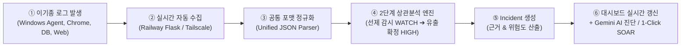
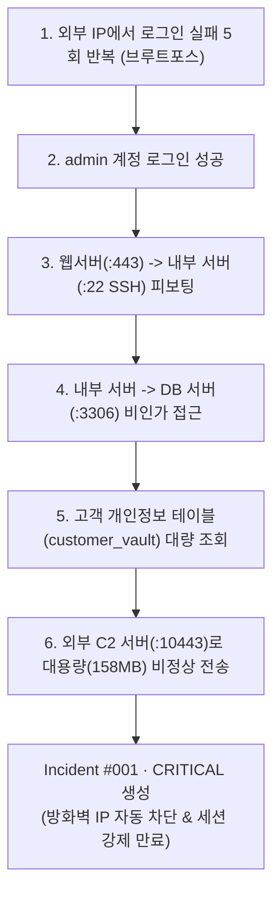
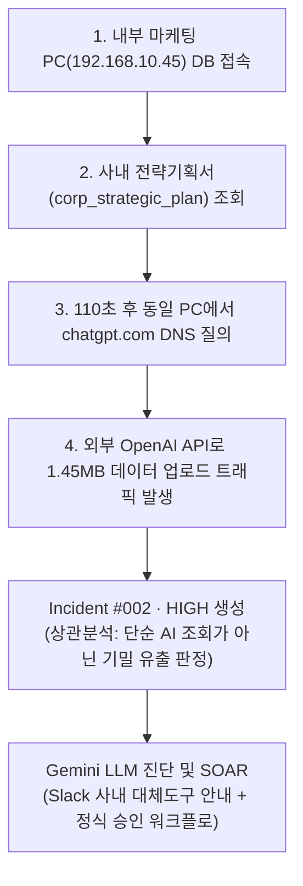

# 🛡️ GIGANG 프로젝트 기획안
### Zero Trust 기반 다기종 로그 상관분석 & 섀도우 AI·IT 거버넌스 자동화 플랫폼

> **프로젝트 명:** GIGANG (CloudShield)  
> **과정 구분:** SKT ALEPH 5개 과목 통합 캡스톤 프로젝트  
> **팀 구성:** 4명 (전원 Day 1부터 병렬 개발)  
> **개발 기간:** 6주 (MVP 완성 및 실환경 연동)  
> **상태:** 구현 완료 및 실서버 파이프라인 검증

---

<aside>
🛡️

**한 줄로 말하면:** 서버·DB·방화벽 로그와 사내 DNS 질의를 실시간으로 자동 수집하여, 외부 해커의 내부 침투(Lateral Movement)와 내부 직원의 섀도우 AI(ChatGPT 등)를 통한 기밀 유출을 동시에 상관분석하고, LLM 기반 양성화 및 자동 대응(SOAR)을 제공하는 통합 관제 시스템이다.

</aside>

---

## 1. 왜 두 프로젝트를 하나로 합쳤는가? (기획 배경)

기존에 검토하던 두 기획은 각자 뛰어났지만, 명확한 한계가 있었습니다.

| 구분 | [후보 1] 네트워크 상관분석 | [후보 2] 섀도우 IT·AI 탐지 | **[통합안] GIGANG** |
| :--- | :--- | :--- | :--- |
| **핵심 장점** | 킬체인 추적, 높은 기술적 깊이 | 섀도우 AI 최신성, 1주차 빠른 결과 | **기술적 깊이 + 최신 AI 거버넌스 결합** |
| **치명적 한계** | 3주차까지 화면이 안 떠서 불안함 | DNS만으로는 기밀을 올렸는지 모름 | **1주차에 화면 도출 + DB 로그 교차검증** |
| **접근통제(3과목)**| 비중 다소 낮음 | 비중 다소 낮음 | **Zero Trust 동적 권한/승인선 전면 보강** |

### 💡 융합이 만들어낸 결정적 시너지 ($1 + 1 = 3$)
> **"직원이 `chatgpt.com`에 접속한 DNS 로그(후보 2)와 직전에 사내 DB에서 고객정보를 대량 조회한 감사 로그(후보 1)를 상관분석(Correlation)으로 연결하면, 기업들이 가장 두려워하는 '생성형 AI를 통한 기업 기밀 유출 킬체인'을 실시간으로 포착할 수 있다."**

---

## 2. 우리가 만들려는 것 — 전체 자동화 흐름

사람이 로그 파일을 수동으로 업로드하는 프로그램이 아닙니다.  
**백그라운드에서 실시간으로 수집부터 분석, 대시보드 갱신까지 무중단으로 동작**합니다.



```
[로그 발생] (Chrome Extension v3.1, Windows 단말, MySQL 8.0 Audit, DNS/Web)
   ↓ 자동
[로그 수집] (GIGANGAgent.exe, Tailscale DB Viewer, Railway Cloud)
   ↓ 자동
[정규화] (모든 이기종 로그를 단일 표준 Unified JSON으로 번역)
   ↓ 자동
[상관분석] (2단계 위험 상태 기계: NORMAL ➔ WATCH ➔ HIGH ➔ 30분 TTL 자가 치유)
   ↓ 자동
[Incident 생성] (판단 근거 4~5개 자동 도출, 위험도 점수 산출)
   ↓ 자동
[대시보드 갱신 & SOAR] (16:9 Bento Grid 관제 콘솔, 공격 킬체인 SVG 시각화, Gemini AI 심층 진단)
```

---

## 3. 핵심 시나리오 2종 (트윈 시나리오)

처음부터 수십 개의 공격을 다루지 않습니다. **기업 보안의 양대 축인 2개 시나리오**를 완벽히 관통합니다.

### 시나리오 A. [외부 위협] 계정 탈취 및 내부 측면이동(Lateral Movement) 킬체인
외부 공격자가 내부망을 타고 들어가 핵심 DB를 탈취하는 과정을 네트워크 토폴로지 맵으로 추적합니다.



### 시나리오 B. [내부 위협] 섀도우 AI 접속 및 기밀 데이터 유출 복합 탐지
내부 직원이 사내 DB 데이터를 생성형 AI(ChatGPT 등)에 붙여넣어 유출하는 행위를 교차 검증합니다.



---

## 4. 프로젝트의 핵심 — 상관분석(Correlation) 판단 기준

단순히 로그를 한곳에 모으는 것이 아니라, **서로 다른 로그를 왜 하나의 사건으로 묶었는지 설명 가능한 근거(Explainable Evidence)**를 산출합니다.

| 판단 기준 | 쉽게 설명하면 | 배점 |
| :--- | :--- | :---: |
| **동일 사용자/계정** | 같은 계정(`admin`, `user01`)에서 이어진 행동인가? | **+2점** |
| **동일 IP / 서브넷** | 동일한 단말 또는 동일 네트워크 대역에서 발생했는가? | **+2점** |
| **시간 근접성** | 10분 이내의 슬라이딩 윈도우 안에 연속으로 일어났는가? | **+2점** |
| **네트워크 홉 연속성** | 앞선 이벤트의 목적지(`dst_ip:port`)가 다음 이벤트의 출발지(`src_ip`)로 이어지는가? | **+2점** |
| **공격 시퀀스 일치** | 공격 킬체인 또는 데이터 유출 시퀀스 순서와 일치하는가? | **+4점** |

> **오탐 방지 앵커(Anchor) 원칙:**  
> 단순히 시간만 가깝다고 로그를 묶지 않습니다. 반드시 **`동일 계정` 또는 `네트워크 홉 연속성`이 1개 이상 성립**할 때만 점수를 누적하여 정상 업무 로그의 오결합(Over-grouping)을 차단합니다.

---

## 5. 섀도우 IT·AI 대응 철학: "무조건 차단"이 아닌 "양성화 및 AI 정밀 진단"

<aside>
🎯

**"막는 도구가 아니라, 찾아서 통제권 안으로 양성화(Sanctioning)하고 지능형으로 진단하는 도구입니다."**

</aside>

* **무조건 차단할 경우의 부작용:** 직원의 46%는 개인 스마트폰/테더링으로 우회 사용 $\rightarrow$ 사내망을 벗어나 관제 사각지대 발생
* **실시간 양성화 및 AI 정밀 진단 워크플로:**
  1. **실시간 트래픽 수집**: Railway 중앙 서버 및 클라이언트 단말 트래픽 기반 사내 접근 도메인 실시간 감지
  2. **100% 실서버 인벤토리 집계**: 접속 도메인(59개 등) 및 사용자/디바이스 통계 실시간 집계 (허위 목업 제거)
  3. **Google Gemini AI 지능형 정밀 진단**: 미등록 도메인의 서비스 성격, 사용자 프롬프트 데이터의 외부 모델 재학습 여부 및 기업 기밀 유출 위험도(HIGH/MEDIUM/LOW) 실시간 분석
  4. **보안 정책 권고 소견 제시**: 보안 관리자 대시보드에 즉시 대응 가이드라인 및 사내 대체 솔루션 안내 권고 제공

---

## 6. 공통 데이터 표준 스키마 (Unified JSON)

서로 다른 로그를 단일 표준으로 번역하여 상관분석 엔진에 공급합니다.

```json
{
  "event_id": "EVT-20260904-00108",
  "timestamp": "2026-09-04T10:05:33Z",
  "log_source": "dns | auth | firewall | db | web",
  "actor": {
    "user_id": "admin",
    "src_ip": "10.0.0.10",
    "src_port": 53120
  },
  "target": {
    "dst_ip": "10.0.0.20",
    "dst_port": 22,
    "domain": "chatgpt.com",
    "hostname": "internal-core-01"
  },
  "action": "ALLOW | DENY | LOGIN_SUCCESS | SELECT | QUERY",
  "payload": {
    "query_string": "SELECT * FROM customer_vault",
    "bytes_sent": 158000000,
    "category": "LateralMovement"
  }
}
```

---

## 7. 우리가 웹에서 보게 될 화면 (구현 완료)

대시보드는 **16:9 와이드 사이버 글래스모피즘(Bento Grid)** 스타일로 구성되며, 다음 핵심 영역을 실시간 제공합니다.

| 영역 | 무엇을 보여주나? |
| :--- | :--- |
| **KPI 와이드 벤토 그리드** | 🔴 긴급·고위험 인시던트 수, 🟡 선제 관찰(WATCH) 대상자 수, 🟢 정상 트래픽 건수, ⏱️ 대응 TTL 타이머 (30분 카운트다운 동적 원형 게이지) |
| **실시간 파이프라인 모니터링** | Railway 실시간 수집 토글(LIVE/OFF) 및 최신 로그 즉시 동기화, 이기종 정규화, 듀얼 상관분석 엔진, Gemini Google Cloud API 헬스체크 |
| **주간 보안 이벤트 추이** | 실제 수집된 이벤트 기반 요일별 트래픽 집계 차트 및 마우스 호버 카운트 툴팁 |
| **공격 킬체인 분석 (Lateral Movement)** | 인시던트별 네트워크 홉(단말 PC ➔ 내부 서버 ➔ DB ➔ 외부 C2/AI) 다이나믹 SVG 경로 렌더링 |
| **AI·IT 거버넌스 인벤토리** | 100% 실서버 트래픽 기반 59개 도메인 인벤토리, 서비스 카테고리, Gemini AI 실시간 위험도 진단 |
| **Gemini AI SOC 코파일럿 & SOAR** | 복합 침해사고 5줄 요약 브리핑, MITRE ATT&CK v14 매핑, 1-Click 단말 격리 / 방화벽 차단 플레이북 |

> **UI 기술 스택:**  
> - **Streamlit 기반 반응형 대시보드:** Custom CSS3 Glassmorphism Bento 테마 적용  
> - **인라인 SVG 다이나믹 렌더링:** 외부 무거운 라이브러리 없이 순수 SVG로 고해상도 킬체인 토폴로지 시각화 달성

---

## 8. 4명 역할 분담 — 전원 첫날부터 병렬 개발

공통 스키마(`common_schema.json` / `schemas/event.py`)를 먼저 합의했기 때문에, **4개 핵심 모듈을 전원 병렬 개발**하여 완벽하게 통합했습니다.

| 담당 | 주요 구현 업무 | 실제 구현 산출물 |
| :--- | :--- | :--- |
| **① 인프라·로그 수집** | Railway 중앙 수집 서버(Flask + PostgreSQL), Docker/MySQL 8.0(`customer_vault` 24,500건) 감사 파이프라인, Tailscale P2P 연동 | `src/collector/`, Railway Live API, DB Audit Viewer |
| **② 단말 수집·정규화** | Windows 실시간 백그라운드 에이전트(`GIGANGAgent.exe`), Chrome Extension(v3.1, 붙여넣기 및 파일 업로드 캡처), Unified JSON 정규화기 | `GIGANGAgent.exe`, `browser_extension/`, `src/normalizer/` |
| **③ 분석·상관분석 엔진** | 2단계 위험 상태 머신(Risk State Machine), 시간 윈도우 기반 복합 교차 검증, 30분 TTL 자가 치유(Self-Healing), Google Gemini AI 지능형 판별 | `gigang/engine/correlation.py`, `gigang/engine/governance.py` |
| **④ 대시보드·SOAR** | Streamlit 16:9 와이드 사이버 글래스모피즘 관제 콘솔, 공격 킬체인 SVG 시각화, MITRE ATT&CK v14 매핑, 1-Click Zero Trust 격리 플레이북 | `gigang/ui/app.py`, `gigang/ai/copilot.py` |

---

## 9. 6주 로드맵 & 최종 완성 마일스톤

| 주차 | 목표 | 완성 결과 (현재 상태) |
| :--- | :--- | :--- |
| **1주차** | 기획 확정 + 스키마 정의 + Mock UI | 공통 Unified JSON 스키마 정의 및 초기 프로토타입 검증 완료 |
| **2주차** | 로그 자동 수집 + 정규화 파서 | Windows/Chrome 감사 에이전트 및 멀티 소스 정규화 파서 구축 완료 |
| **3주차 (MVP)** | **탐지 + 듀얼 상관분석 E2E 관통** | **2단계 위험 상태 머신(NORMAL ➔ WATCH ➔ HIGH ➔ 치유) 파이프라인 관통** |
| **4주차** | 알고리즘 고도화 & 네트워크 맵 | 킬체인 토폴로지 SVG 시각화 및 실시간 타임라인 렌더링 완료 |
| **5주차** | Zero Trust 격리 & 실서버 연동 | Railway 중앙 수집 서버 배포 및 Docker/MySQL 2.4만 건 감사 연동 완료 |
| **6주차** | 통합 검증 + 보안 감사 + 최종 패키징 | 가짜 더미 완전 제거, 실서버 100% 데이터 기반 관제 완성, GitHub 배포 완료 |

---

## 10. SKT ALEPH 5개 과목 100% 매핑

두 기획안의 공통 약점이었던 **3과목(접근통제)**을 완벽히 보강했습니다.

| 과목 | GIGANG 내 구현 요소 | 비중 |
| :--- | :--- | :---: |
| **1과목 AI·자동화** | Google Gemini AI 기반 미등록 도메인 성격/재학습 위험도 진단 및 침해사고 5줄 브리핑 | ★★★ |
| **2과목 네트워크·ZT** | Chrome/DNS 질의 분석, 피보팅 공격 경로 추적, Zero Trust 최소 권한 및 단말 격리 | ★★★ |
| **3과목 접근통제** | **사내 기밀 DB(`customer_vault`) 접근 감사, 2단계 상태 머신 기반 선제 감시(WATCH)** | **★★★ (보강완료)** |
| **4과목 이상탐지** | DB 조회 ➔ AI 접속 시차 슬라이딩 윈도우 상관분석, 대용량 아웃바운드 스파이크 이상 탐지 | ★★★ |
| **5과목 SOAR** | 방화벽 IP 차단 스크립트 생성, 단말 네트워크 격리 플레이북, 침해 세션 즉시 만료 | ★★★ |

---

## 11. 면접 및 최종 평가 필살기 Q&A (3선)

### Q1. "두 가지 기능을 합쳤는데 너무 산만하지 않나요?"
> **답변:** "산만하게 나열한 것이 아니라 **'사내 핵심 데이터의 유출 경로'라는 단 하나의 관점으로 통합**했습니다. 해커가 외부에서 침투하여 DB를 털어가는 경로(외부 킬체인)와 내부 임직원이 미인가 생성형 AI로 데이터를 반출하는 경로(섀도우 AI 유출)는 오늘날 기업이 마주한 양대 위협입니다. 저희는 이를 '이기종 로그 상관분석'이라는 단일 아키텍처로 우아하게 통합했습니다."

### Q2. "이거 이미 SIEM이나 CASB에 있는 기술 아닌가요?"
> **답변:** "맞습니다. 다만 상용 솔루션을 그대로 모방하는 것이 아니라, **'도대체 서로 다른 로그를 무슨 기준으로 엮어야 진정한 침해사고가 되는가?'**라는 상관분석의 근본 메커니즘을 직접 설계했습니다. 또한 고가의 CASB를 도입하기 어려운 환경을 고려해, 단말 브라우저 확장과 중앙 수집 서버, LLM을 결합하여 비용 효율적인 거버넌스 대안을 제시했습니다."

### Q3. "DNS 로그만으로 데이터 유출을 어떻게 입증하나요?"
> **답변:** "그것이 기존 섀도우 IT 도구의 한계였습니다. 저희는 **DNS 질의 전후의 DB 감사 로그(SELECT 민감정보)와 아웃바운드 전송/붙여넣기 이벤트를 교차 상관분석**했습니다. 직전에 대량의 기밀 조회가 있었는지, 그리고 실제 외부 전송 행위가 발생했는지를 함께 검증함으로써 오탐 없는 확실한 유출 증거를 제시합니다."

---

## 12. 최종 완료 체크리스트 (Done Definition)

- [x]  팀 회의: 본 통합 기획안(`GIGANG`)으로 최종 확정 및 구현
- [x]  4인 역할 배정 및 병렬 개발 완료 (①인프라, ②에이전트/정규화, ③상관분석/AI, ④대시보드/SOAR)
- [x]  GitHub 저장소 생성(`GIGANG_SIM_TEST`) 및 최신 클린 코드 푸시 완료
- [x]  공통 데이터 스키마(`schemas/event.py`) 및 Unified JSON 파서 구현 완료
- [x]  올인원 관제 대시보드(`streamlit run app.py`) 16:9 Bento Grid 테마 구동 완료
- [x]  Google Gemini AI (Google Cloud API) 키 연동 및 실시간 위험도 진단 모듈 가동 완료
- [x]  실제 Docker/MySQL 8.0 `customer_vault` 2.4만 건 감사 파이프라인 및 Tailscale 연동 완료
