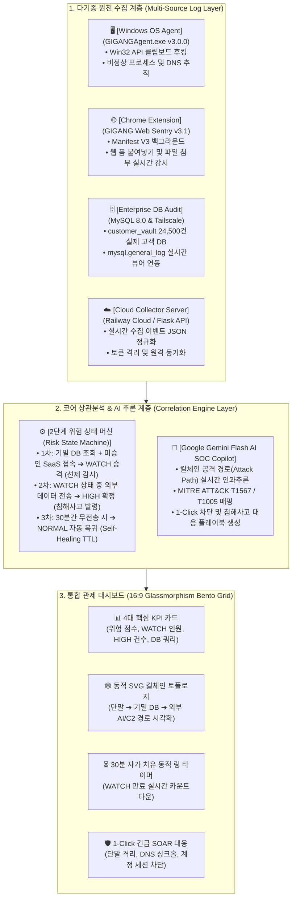
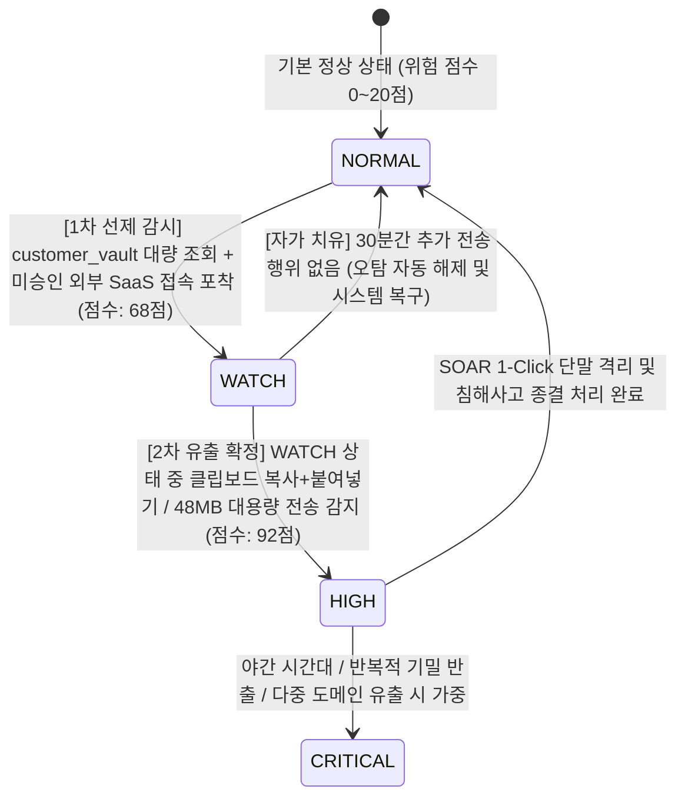

# 🛡️ GIGANG (기강 / CloudShield v3.1)
### Zero Trust 기반 엔드포인트-DB-웹 3차원 상관분석 & Shadow AI 거버넌스 플랫폼


> **"기존 SIEM처럼 데이터가 다 털린 후에 울리는 '사후 약방문'도, DLP처럼 업무를 마비시키는 '무조건 차단'도 아닙니다.**  
> GIGANG는 **사내 DB 기밀 접근 ➔ 단말기 클립보드/프로세스 ➔ 브라우저 웹 전송**을 3차원으로 교차 추적하여, **'선제 감시(WATCH) ➔ 실시간 유출 시 즉시 대응(HIGH) ➔ 정상 업무 시 스스로 정상화(30분 TTL 자가 치유)'**하는 차세대 지능형 보안관제(SecOps) 플랫폼입니다."

---

## 📌 1. 핵심 아키텍처 & 4대 실제 연동 파이프라인

본 프로젝트는 단순 가상 목업(Mock)이 아닌, **실제 엔드포인트 OS, 웹 브라우저, 엔터프라이즈 DB, 클라우드 백엔드가 유기적으로 연결된 4대 실시간 데이터 파이프라인**으로 작동합니다.



---

## ⚡ 2. 2단계 위험 상태 기계 (Risk State Machine)

보안 관제 요원의 알람 피로도(Alert Fatigue)를 해소하고 골든타임을 확보하기 위해 독자 개발한 **적응형 위험 상태 기계**입니다.



### 🛡️ 잠복형 유출(Dormant Exfiltration) 방어
- 30분 TTL이 지나 `NORMAL`로 복귀했더라도, 영속 DB(`risk_history`)에 24시간 동안 과거 `WATCH` 이력이 보존됩니다.
- 수 시간 뒤 갑작스러운 외부 트래픽 스파이크 발생 시 `has_user_prior_watch_history` 검사를 통해 **지연 잠복형 유출(INC-DORMANT)**로 직행 차단합니다.

---

## 🎬 3. 시연 및 테스트 시나리오 ("마케팅팀 김대리 사건")

| 단계 | 행동 및 로그 원천 | 시스템 내부 동작 및 판정 | 대시보드 표출 화면 |
| :---: | :--- | :--- | :--- |
| **Phase 0**<br>(09:00) | 정상 업무 로그인<br>(단말 에이전트 수집) | 계정 상태: `NORMAL (15점)` | 평온한 그린 상태, 실시간 파이프라인 정상 표시 |
| **Phase 1**<br>(14:00) | `customer_vault` 2.4만 건 조회 +<br>미승인 AI(`chatgpt.com`) 접속 | **1차 선제 감시 발동**<br>계정 상태 ➔ `WATCH (68점)` 승격 (30분 TTL 부여) | 상단 Ticker 노란색 경고 점등, 30분 링 타이머 카운트다운 시작 |
| **Phase 2**<br>(14:08) | 2.4만 건 CSV + 기획서 묶음(48MB)<br>외부 전송 / 클립보드 붙여넣기 | **2차 침해사고 확정**<br>계정 상태 ➔ `HIGH (92점)` 폭발 (`INC-SEC-015`) | SVG 토폴로지 붉은 공격선 연결, Gemini AI 침해사고 긴급 브리핑 |
| **Phase 3**<br>(14:09) | 관제사 1-Click 긴급 대응 클릭 | 단말 네트워크 즉각 격리 + DNS 싱크홀 + AD 계정 잠금 | 조치 완료 알림 및 포렌식 보고서 자동 생성 |
| **Edge Case**<br>(14:35) | 단순 질문 후 전송 없이 30분 경과 | **시스템 자가 치유 (Self-Healing)**<br>`WATCH` ➔ `NORMAL` 자동 복구 | 오탐 자동 정리 및 정상 상태 환원 |

---

## 📚 4. 프로젝트 문서 완독 가이드 (어떤 문서를 읽어야 하는가?)

프로젝트를 100% 깊이 있게 이해하고 평가하기 위해 문서들이 목적별로 체계화되어 있습니다:

```
📦 GIGANG 문서 맵 (Documentation Sitemap)
 ├── 📄 README.md                             <-- [현재 문서] 프로젝트 전체 개요, 파이프라인 구조, 빠른 실행
 ├── 📋 GIGANG_Notion_Proposal.md             <-- [필독 1: 기획/심사용] 5개 교과목 연계, 전사 아키텍처, 6주 완성 로드맵
 ├── 🎬 GIGANG_Full_Scenario_Notion.md        <-- [필독 2: 발표/시연용] 상세 시나리오, 1분 발표 스피치 대본, 심사위원 Q&A 치트키
 ├── ✅ GIGANG_Notion_Deliverables.md         <-- [검증용] 최종 산출물 체크리스트, 모델 사양, 팀원 역할 분담
 ├── 🤖 GIGANG_Governance_Gemini_Review.md    <-- [기술 심층] Shadow AI 거버넌스 및 Gemini API 연동 분석
 ├── 🗄️ docs/GIGANG_DB_Test_Guide.md          <-- [실전 DB] MySQL 8.0 Audit 로그, BLOB 디코딩, Tailscale 연동 가이드
 └── 📝 GIGANG_Meeting_Minutes_Notion.md      <-- [개발 히스토리] 1~6차 전 과정 회의록 및 의사결정 기록
```

1. **프로젝트의 기획 의도와 기술적 완성도를 평가하고 싶을 때**:
   👉 [`GIGANG_Notion_Proposal.md`](./GIGANG_Notion_Proposal.md)
   - 문제 정의, 기존 솔루션 한계 극복 방안, 4대 데이터 파이프라인, 16:9 Glassmorphism Bento Grid 명세, 정보보안 5대 핵심 교과목 연계성 기술.
2. **시연 시나리오와 발표 대본, 예상 질의응답을 확인하고 싶을 때**:
   👉 [`GIGANG_Full_Scenario_Notion.md`](./GIGANG_Full_Scenario_Notion.md)
   - 김대리 사건 4단계 전개 과정, 오탐 자가 치유(TTL) 및 잠복형 유출 방어 로직, 1분 핵심 발표 스피치 대본, 심사위원 단골 공격 질문 3종 Q&A 수록.
3. **제출물 목록과 요구사항 반영 여부를 검토하고 싶을 때**:
   👉 [`GIGANG_Notion_Deliverables.md`](./GIGANG_Notion_Deliverables.md)
   - 소스코드 저장소, AI 모델 규격(`Google Gemini Flash`), Tailscale DB 뷰어 주소, 팀원 역할 매핑(`팀원 1~4`).
4. **실제 DB 환경 및 감사 쿼리를 테스트하고 싶을 때**:
   👉 [`docs/GIGANG_DB_Test_Guide.md`](./docs/GIGANG_DB_Test_Guide.md)
   - MySQL 8.0 `mysql.general_log` 조회 쿼리, `CONVERT(argument USING utf8)`을 통한 BLOB 문제 해결, Tailscale VPN 연동 튜토리얼.

---

## 👥 5. 팀 구성 및 역할 분담

공정하고 객관적인 평가를 위해 익명화 표준(`팀원 1~4`)을 적용했습니다.

| 구분 | 담당 영역 | 핵심 산출물 및 기여 내용 |
| :---: | :---: | :--- |
| **팀원 1** | **Collector & Log Ingestion** | • `GIGANGAgent.exe v3.0.0` (Win32 API 클립보드 후킹, DNS/프로세스 수집기)<br>• Chrome Extension v3.1 Web Sentry 배포 및 연동 |
| **팀원 2** | **Normalizer & Schema** | • 다기종 이기종 로그 Unified JSON 정규화 파이프라인 구축<br>• 미등록 비정형 로그 Fallback 정규화 및 데이터 정합성 검증 |
| **팀원 3** | **Correlation Engine & DB** | • 2단계 위험 상태 기계 (`NORMAL ➔ WATCH ➔ HIGH ➔ 30분 TTL`) 엔진 구현<br>• MySQL 8.0 `customer_vault` 2.4만 건 DB 감사 로그 및 Tailscale VPN 연동 |
| **팀원 4** | **Dashboard & AI SOC & PM** | • 16:9 다크 글래스모피즘 Bento Grid 관제 대시보드 풀스택 구축<br>• Google Gemini Flash 연동 (킬체인 추론, MITRE 매핑, 1-Click SOAR 대응) |

---

## 🚀 6. 빠른 시작 가이드 (Quick Start)

### 사전 준비사항
- Python 3.10 이상
- Google Gemini API Key (선택: 미입력 시 내장 Rule-based 로컬 엔진으로 무중단 자동 전환)

### 설치 및 실행
```bash
# 1. 저장소 클론
git clone https://github.com/dldaudlee36/GIGANG_SIM_TEST.git
cd GIGANG_SIM_TEST

# 2. 필수 의존성 패키지 설치
pip install -r requirements.txt

# 3. 환경 변수 설정 (.env 파일 생성)
# GEMINI_API_KEY=your_gemini_api_key_here

# 4. 통합 관제 대시보드 실행
streamlit run app.py
```
실행 후 웹 브라우저에서 `http://localhost:8501`로 접속하면 16:9 Bento Grid 보안관제 센터가 구동됩니다.

---
*Developed with ❤️ by GIGANG Security Operations Team*
