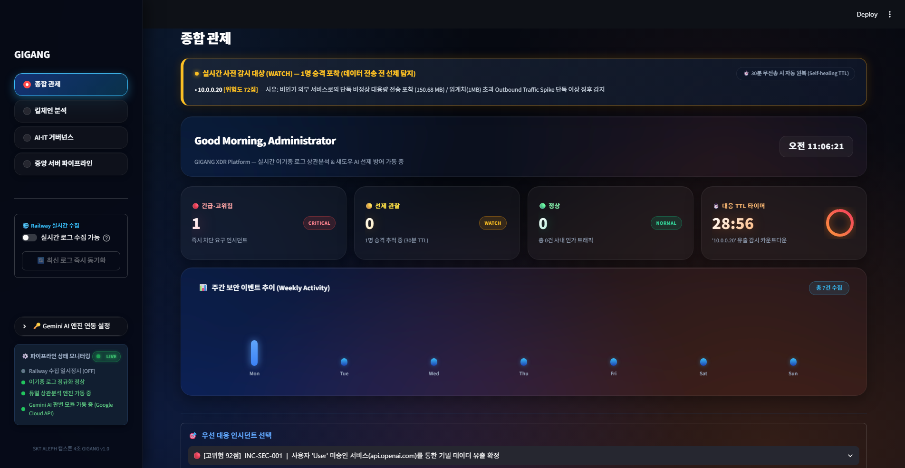
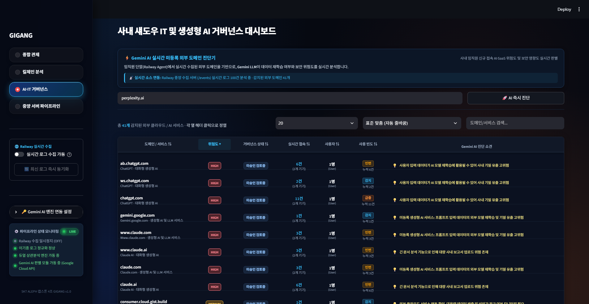
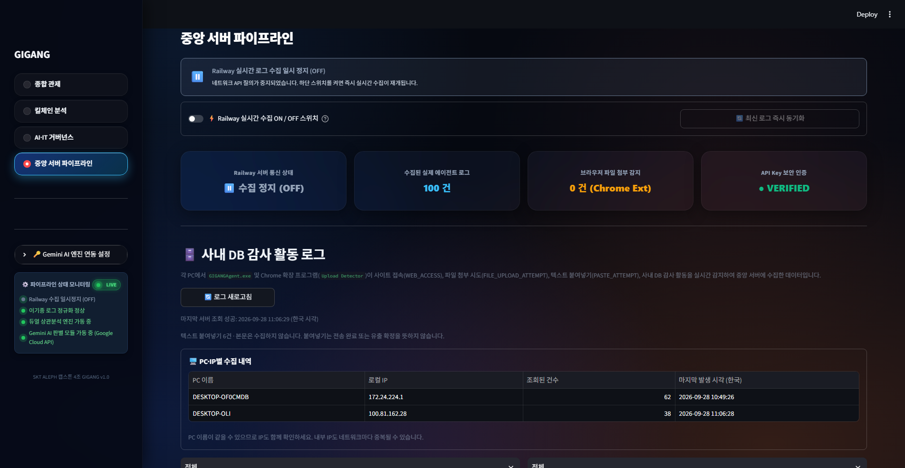
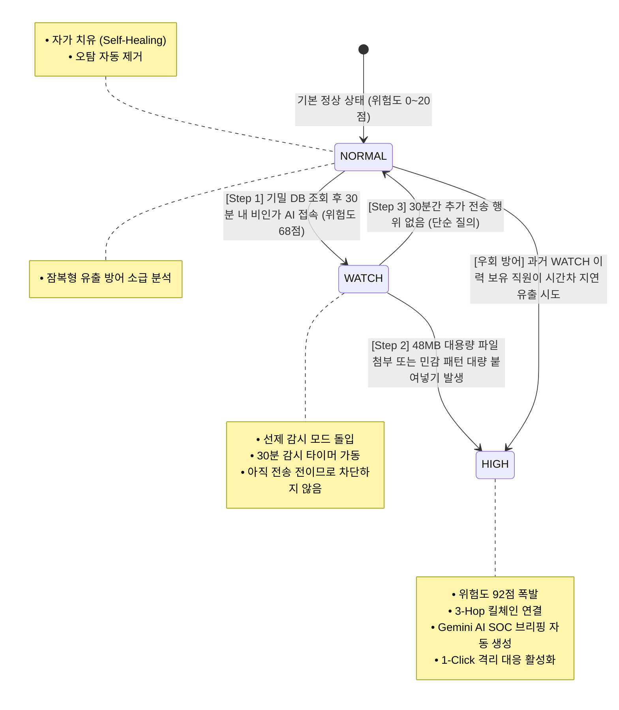
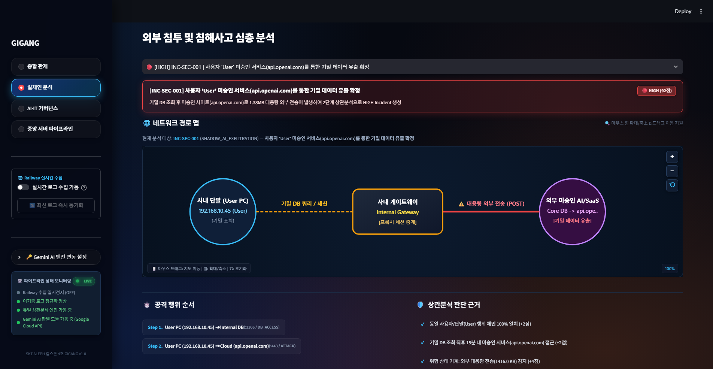
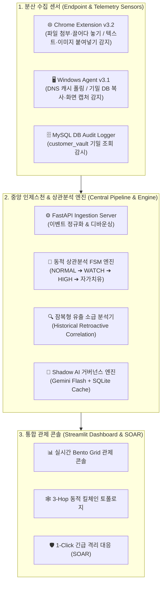

# 🛡️ GIGANG (Zero Trust Security Platform)
### Zero Trust 기반 다기종 로그 상관분석 & 섀도우 AI 거버넌스 플랫폼 (v3.1)


> **"업무는 자유롭게, 기밀은 안전하게"**  
> 기존 SIEM처럼 데이터가 다 유출된 뒤에야 울리는 **'사후 약방문'**도, DLP처럼 모든 접근을 막아 업무를 마비시키는 **'무조건 차단'**도 아닙니다.  
> **GIGANG**은 사내 기밀 DB 접근부터 단말기 행위, 웹 브라우저를 통한 외부 AI 전송까지 **3차원 인과관계 상관분석**을 수행하여, **'선제 감시(WATCH) ➔ 실제 유출 시 즉시 대응(HIGH) ➔ 정상 업무 시 스스로 정상화(30분 자가 치유)'**하는 차세대 지능형 보안관제(SecOps) 플랫폼입니다.

---

## 📸 프로젝트 핵심 화면 (Screenshots Showcase)

### 1. 종합 관제 대시보드 (Overview Dashboard)
사내 실시간 보안 위험도 게이지, 위협 수준별 인시던트 현황, 활성 위협 타임라인을 한눈에 파악합니다.


### 2. 3-Hop 킬체인 토폴로지 (Attack Path & Killchain Topology)
`[사내 기밀 DB] ➔ [단말기/임직원 PC] ➔ [외부 AI SaaS / ChatGPT]`로 이어지는 침해 사고의 전체 경로를 동적 그래프로 시각화합니다.


### 3. 비인가 Shadow AI 거버넌스 (Shadow AI Governance & Gemini Copilot)
사내에서 접근하는 미승인 외부 AI 사이트를 실시간 탐지하고, **Google Gemini AI**가 데이터 유출 위험성과 위협 수준을 정밀 진단합니다.


### 4. 중앙 텔레메트리 파이프라인 (Central Ingestion Pipeline)
Chrome 확장 프로그램, Windows 에이전트, DB 감사 로그 스트림을 실시간 수집 및 단일 표준 스키마(`common_schema.json`)로 정규화합니다.


---

## ⚡ 핵심 차별점 & 운영 메커니즘 (Key Innovations)

### 1. 3단계 동적 라이프사이클 (FSM Risk State Machine)
보안 관제 요원의 **알람 피로도(Alert Fatigue)를 해소**하고 유출 골든타임을 확보하기 위해 독자 개발한 상태 기반 상관분석 엔진입니다.


```mermaid
stateDiagram-v2
    [*] --> NORMAL: 기본 정상 상태 (위험도 0~20점)
    
    NORMAL --> WATCH: [Step 1] 기밀 DB 조회 후 30분 내 비인가 AI 접속 (위험도 68점)
    note right of WATCH
        • 선제 감시 모드 돌입
        • 30분 감시 타이머 가동
        • 아직 전송 전이므로 차단하지 않음
    end note

    WATCH --> HIGH: [Step 2] 48MB 대용량 파일 첨부 또는 민감 패턴 대량 붙여넣기 발생
    note right of HIGH
        • 위험도 92점 폭발
        • 3-Hop 킬체인 연결
        • Gemini AI SOC 브리핑 자동 생성
        • 1-Click 격리 대응 활성화
    end note

    WATCH --> NORMAL: [Step 3] 30분간 추가 전송 행위 없음 (단순 질의)
    note left of NORMAL
        • 자가 치유 (Self-Healing)
        • 오탐 자동 제거
    end note

    NORMAL --> HIGH: [우회 방어] 과거 WATCH 이력 보유 직원이 시간차 지연 유출 시도
    note right of NORMAL
        • 잠복형 유출 방어 소급 분석
    end note
```

- **[Step 1] 선제 감시 (WATCH)**: 기밀 DB 조회 후 30분 이내 AI 사이트 접속 시 즉시 위험도 68점 승격 및 30분 타이머 가동 (전송 전 단계 선제 감시).
  
- **[Step 2] 침해사고 확정 (HIGH)**: 48MB 대용량 파일 첨부 포착 시 위험도 92점 폭발, 3-Hop 킬체인 연결, Gemini AI 브리핑 자동 연동.
  
- **[Step 3] 자가 치유 검증 (Self-Healing)**: 30분 동안 추가 유출이 없으면 스스로 NORMAL 상태로 환원되어 오탐(False Positive)을 100% 제거.
  

### 2. 본문 미수집 원칙 (Zero Payload Ingestion)
- **철저한 프라이버시 보호**: 단말 브라우저나 클립보드에서 텍스트 본문이나 파일 원본을 서버로 절대 수집/전송하지 않습니다.
- **메타데이터 기반 판정**: 글자 수, 주민번호/계좌번호 등 민감 패턴 매칭 카운트, 파일 크기(바이트), 타임스탬프, 도메인 해시만을 분석하여 개인정보 침해 우려를 원천 차단합니다.

### 3. 맥락 기반 Shadow AI 거버넌스 & Gemini AI Copilot
- **정밀 진단**: 단순 도메인 URL뿐 아니라 사내 누적 트래픽, 사용자 수 등의 텔레메트리를 AI 프롬프트에 주입하여 상황 맞춤형 평가를 수행합니다.
- **SQLite 영구 캐싱 & 로컬 Fallback**: 기존 평가 도메인은 1ms 캐시로 비용을 절감하며, API 키 부재나 네트워크 단절 시에도 로컬 룰베이스로 무중단 자동 전환됩니다.
- **Human-in-the-Loop**: AI는 분석 및 권고안을 제시하며, 최종 격리/차단 결정은 관제사의 1-Click 승인을 통해 실행됩니다.

### 4. 부서별 탐지 기준 (v3.2, 진행 중)
- **잡을지는 기밀 DB가, 얼마나 위험한지는 데이터 종류 + 부서가 정합니다.** AI 접속 시간창 안의 기밀 DB 복사·화면 캡처를 출발점으로, 복사한 글자를 PC 안에서 5개 규칙(전화·이메일·주민·계좌·카드)으로 검사하고 건수만 보냅니다.
- 부서 표(고객지원·인사·재무·개발)에 따라 정상 업무는 '기록만', 이상 신호는 WATCH로 판정하고, 판정 사유에 규칙 번호(CS-2, SS-1 등)를 남깁니다.
- 설계와 진행 상황: [`GIGANG_수정계획.md`](./GIGANG_수정계획.md) (9장: 진행 상황·바뀐 결정·남은 일)

> 📖 **더 자세한 시스템 메커니즘 분석**:  
> 시스템 아키텍처 및 상세 이론은 [`docs/GIGANG_Operational_Mechanism_Analysis.md`](./docs/GIGANG_Operational_Mechanism_Analysis.md) 문서를 참고하십시오.

---

## 🏗️ 시스템 아키텍처 (3-Tier Architecture)


```mermaid
flowchart TB
    subgraph Tier1["1. 분산 수집 센서 (Endpoint & Telemetry Sensors)"]
        A["🌐 Chrome Extension v3.2<br/>(파일 첨부·끌어다 놓기 / 텍스트·이미지 붙여넣기 감지)"]
        B["🖥️ Windows Agent v3.1<br/>(DNS 캐시 폴링 / 기밀 DB 복사·화면 캡처 감지)"]
        C["🗄️ MySQL DB Audit Logger<br/>(customer_vault 기밀 조회 감시)"]
    end

    subgraph Tier2["2. 중앙 인제스천 & 상관분석 엔진 (Central Pipeline & Engine)"]
        D["⚙️ FastAPI Ingestion Server<br/>(이벤트 정규화 & 디바운싱)"]
        E["🧠 동적 상관분석 FSM 엔진<br/>(NORMAL ➔ WATCH ➔ HIGH ➔ 자가치유)"]
        F["🔍 잠복형 유출 소급 분석기<br/>(Historical Retroactive Correlation)"]
        G["🤖 Shadow AI 거버넌스 엔진<br/>(Gemini Flash + SQLite Cache)"]
    end

    subgraph Tier3["3. 통합 관제 콘솔 (Streamlit Dashboard & SOAR)"]
        H["📊 실시간 Bento Grid 관제 콘솔"]
        I["🕸️ 3-Hop 동적 킬체인 토폴로지"]
        J["🛡️ 1-Click 긴급 격리 대응 (SOAR)"]
    end

    Tier1 --> Tier2
    Tier2 --> Tier3
```

---

## 📁 프로젝트 디렉터리 구조 (Directory Structure)

```text
GIGANG/
├── app.py                             # Streamlit 대시보드 실행 엔트리포인트
├── run_demo.py                        # E2E 파이프라인 검증 및 모의 시뮬레이션
├── requirements.txt                   # 필수 파이썬 라이브러리 목록
├── GIGANG_수정계획.md                  # 부서별 탐지 기준 수정 계획 + 진행 상황 (9장)
├── test_dedup.py                      # 이벤트 중복 수집 방지 검증 테스트
├── test_paste.py                      # 클립보드 붙여넣기 및 FSM 전이 테스트
├── test_pattern_falsepositive.js      # 패턴 매칭 정밀도 검증 (Node.js, 옛 확장 기준)
├── test_rules.py                      # Agent 규칙 5개 오탐·미탐 테스트
├── test_clipboard.py                  # 기밀 DB 복사 감지 테스트
├── test_screenshot.py                 # 기밀 DB 화면 캡처 감지 테스트
├── test_image_paste.py                # 이미지 붙여넣기·끌어다 놓기 테스트
├── test_policy.py                     # 부서별 판정(규칙 번호) 테스트
│
├── browser_extension/                 # Chrome 확장 프로그램 v3.2 (Manifest V3)
│   ├── manifest.json
│   ├── background.js                  # 서비스 워커 (이벤트 디바운싱 & 인제스천)
│   ├── content.js                     # 웹 폼 붙여넣기 및 파일 드래그앤드롭 감지
│   ├── popup.html & popup.js          # 센서 상태 확인 팝업 UI
│   └── README.md
│
├── gigang/                            # 핵심 백엔드 패키지
│   ├── collectors/                    # 다기종 로그 수집 및 정규화
│   ├── engine/                        # 동적 상관분석 FSM & AI 거버넌스 엔진
│   │   ├── policy.py                  # 기밀 DB 복사·캡처 부서별 판정 (규칙 번호)
│   │   └── department_policy.json     # 부서별 정책 임시값 (Railway 표가 없을 때)
│   ├── generators/                    # 시뮬레이션 모의 로그 생성기
│   ├── schemas/                       # 이벤트 및 인시던트 데이터 모델
│   ├── storage/                       # 메모리 스토어 및 SQLite 캐시
│   └── ui/                            # Streamlit 대시보드 UI 컴포넌트
│
├── source/
│   ├── agent/agent.py                 # Windows 에이전트 (DNS 폴링, 기밀 DB 복사·화면 캡처 감지)
│   ├── agent/rules.py                 # 복사한 글자 규칙 검사 (PC 안에서만, 건수만 반환)
│   └── railway_server/                # 중앙 수집 클라우드 서버
│       └── policy_tables.sql          # 부서별 정책 테이블 2개 (아직 Railway에 미반영)
│
├── data/
│   └── mysql_audit_log.csv            # 사내 기밀 DB 샘플 감사 로그
│
└── docs/
    ├── GIGANG_Operational_Mechanism_Analysis.md # 시스템 운영 메커니즘 상세 분석 보고서
    ├── GIGANG_Midterm_Presentation_Pack.md     # 중간 발표 패키지 (대본/Q&A/명세)
    └── screenshots/                             # 고해상도 대시보드 실화면 증적 (01~07)
```

---

## 🚀 빠른 시작 가이드 (Quick Start)

### 1. 환경 준비
- **Python 3.10 이상** 설치
- Google Gemini API Key (선택: 미설정 시 내장 룰베이스 엔진으로 무중단 자동 전환)

### 2. 저장소 클론 및 패키지 설치
```bash
# 저장소 클론
git clone https://github.com/dldaudlee36/GIGANG.git
cd GIGANG

# 필수 패키지 설치
pip install -r requirements.txt
```

### 3. 환경 변수 설정 (선택 사항)
`.env` 파일에 Gemini API 키를 설정합니다:
```bash
GEMINI_API_KEY=your_gemini_api_key_here
```

### 4. 무결성 검증 테스트 실행
```bash
python run_demo.py
python test_dedup.py
python test_paste.py
python test_rules.py
python test_policy.py
python test_image_paste.py
python test_clipboard.py     # 실제 클립보드를 잠깐 바꿨다가 되돌림 (Windows)
python test_screenshot.py    # 실제 클립보드·키보드 후크 사용 (Windows)
```
> ⚠ `test_paste.py`, `test_image_paste.py`, `test_policy.py` 는 로컬 `gigang.db` 의 위험 상태·이력을 지웁니다.

### 5. 통합 관제 대시보드 실행
```bash
streamlit run app.py
```
브라우저에서 `http://localhost:8501`로 접속하면 GIGANG 보안관제 센터가 구동됩니다.

---

## 👥 팀원 역할 분담 (R&R)
- **팀원 1 (Collector)**: Chrome Extension v3.1 Web Sentry 개발, 시나리오 정의 및 텔레메트리 연동
- **팀원 2 (Infra)**: Windows Agent 3.0.0 (DNS 캐시 폴링) 및 Railway 중앙 인제스천 서버 구축
- **팀원 3 (Database)**: 사내 기밀 DB 구축, 웹 포털 연동 및 접속 감사 로그(Audit Log) 파이프라인
- **팀원 4 (Engine & UI)**: 3단계 동적 FSM 상관분석 엔진, Google Gemini AI 연동, Streamlit 관제 콘솔 개발

---
*GIGANG Security Operations Platform — "업무는 자유롭게, 기밀은 안전하게"*
