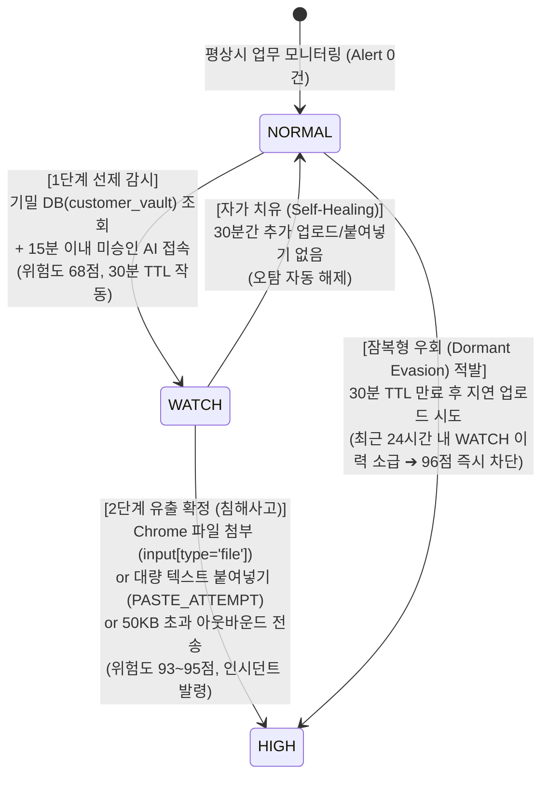

# 🛡️ GIGANG 긴급 팀 회의 안건 분석 & 아키텍처 가이드

> 💡 **문서 개요**: 본 문서는 팀 긴급회의에서 논의된 핵심 쟁점(위험 점수, LLM 호출 시점, 실제 DB 로그 연동, 대응 기능 범위 등)을 보안 공학 및 실무 관점에서 세밀하게 분석하고, 팀원들의 오해를 바로잡으며 캡스톤 최종 시연을 성공시키기 위한 실행 지침을 정리한 가이드입니다.

---

## 📑 목차
1. [회의 총평 및 3대 핵심 진단](#1-회의-총평-및-3대-핵심-진단)
2. [🚨 팀원들의 오해 및 정정 사항 (Critical Fact-Check)](#2--팀원들의-오해-및-정정-사항-critical-fact-check)
3. [💡 제안된 아이디어 및 실행 계획 타당성 감정](#3--제안된-아이디어-및-실행-계획-타당성-감정)
4. [🛠️ GIGANG 2단계 위험 상태 기계 표준 규격 (현 코드 기준)](#4-️-gigang-2단계-위험-상태-기계-표준-규격-현-코드-기준)
5. [🎯 팀 공유용 핵심 요약본 (카톡/디스코드 공지용)](#5--팀-공유용-핵심-요약본-카톡디스코드-공지용)

---

## 1. 회의 총평 및 3대 핵심 진단

팀원들이 제기한 문제의식(**오탐에 대한 우려, 실제 DB 감사 로그 연동의 필요성, 차단 부작용에 대한 경계**)은 현업 보안 관제(SOC/EDR)에서도 매우 중요하게 다루는 실질적이고 성숙한 고민입니다.

그러나 회의록을 분석한 결과 다음 **3가지 치명적 병목**이 발견되었습니다.

```
[회의록에서 발견된 3대 병목]
1. 치명적 보안 결함 아이디어: "LLM에게 기밀 텍스트를 전송하여 DB 데이터와 비교시키자"
2. 이미 구현된 엔진의 중복 논의: 점수 체계, 30분 TTL, 상태 기계가 이미 코드에 완성되어 있음
3. 마감 전 범위 확장 위험(Scope Creep): 팀원 접근용 웹페이지 신규 제작, 신규 서버 구축 등
```

---

## 2. 🚨 팀원들의 오해 및 정정 사항 (Critical Fact-Check)

### ① [치명적 결함] "LLM(Gemini)에게 붙여넣은 텍스트가 DB 데이터인지 비교·판별시키자?" ➔ **절대 금지**
* **회의 내용**: DB 조회 후 AI 사이트에 붙여넣은 내용이 실제 DB 데이터인지 LLM에게 물어보자는 제안.
* **치명적 한계 및 문제점**:
  1. **사내 기밀의 '2차 외부 유출' (컴플라이언스 위반)**: 사내 기밀 유출을 막겠다는 보안 솔루션이 검증을 핑계로 **사내 기밀 원문을 외부 구글 Gemini API로 전송하는 주체**가 됩니다. 개인정보보호법 및 ISMS 심사 탈락 사유입니다.
  2. **지연 시간(Latency) 폭증으로 실시간 탐지 불가**: DB 수천 행과 붙여넣은 텍스트를 LLM 프롬프트에 넣고 비교하면 API 응답에 최소 3~5초가 소요되어 패킷이 이미 전송된 후입니다.
  3. **환각(Hallucination)에 의한 오탐**: 띄어쓰기, 변수명 변조, 난독화된 텍스트에 대해 LLM의 유사도 비교는 정확한 일치 여부를 보장하지 못합니다.
* **✅ 올바른 보안 엔지니어링 해법 (이미 구현된 방식)**:
  * 텍스트 본문은 외부로 단 1글자도 내보내지 않고, **단말 브라우저(`content.js`) 로컬에서 'Zero-Content 정규식/체크섬 검사'**를 수행합니다.
  * 우리 시스템은 이미 본문은 메모리에서 즉시 폐기하고 **"글자 수(200자 이상)"**와 **"주민번호(월/일 유효성) / 카드번호(Luhn 체크섬) 패턴 검출 개수"**만 에이전트로 넘겨 0.001초 만에 판별하도록 완벽하게 설계되어 있습니다.

---

### ② [엔진 현황 오해] "점수, 등급 전환, 30분 관찰 시간 기준이 아직 안 정해졌다?" ➔ **이미 구현 완료**
* **회의 내용**: 점수 체계와 관찰 시간 시작·만료 기준을 하나의 규칙으로 새로 정리해야 한다는 논의.
* **진실 및 정정**:
  * 깃허브 최신본([`correlation.py`](file:///D:/Jacob/CAPSTONE/GIGANG_Git/gigang/engine/correlation.py))에 이미 **수학적 2단계 유한 상태 기계(Finite State Machine)**가 테스트까지 완료된 상태로 구현되어 있습니다.
  * 팀원들이 코드를 보지 않고 바퀴를 다시 발명(Reinventing the wheel)하려는 상황이므로, **기존 코드를 표준으로 확정**하고 불필요한 회의 시간을 줄여야 합니다.

---

### ③ [오탐 우려 오해] "단순 복사·붙여넣기나 정상 업무 업로드까지 잡아서 오탐이 날 것이다?" ➔ **단독 행위는 절대 안 잡힘**
* **회의 내용**: 일반 직원의 정상적인 업무 업로드나 무관한 복사·붙여넣기가 유출로 오인될 수 있다는 우려.
* **진실 및 정정**:
  * GIGANG는 **단독 행위로는 절대 경보를 울리지 않습니다.**
  * 평상시 **`NORMAL` 상태의 일반 직원은 ChatGPT에 아무리 긴 글을 붙여넣거나 파일을 올려도 `HIGH` 인시던트가 발령되지 않습니다.**
  * 오직 **[기밀 DB 조회(조건 A) ➔ 15분 내 미승인 AI 접속(조건 B) ➔ 파일첨부/붙여넣기(조건 C)]**라는 **3중 킬체인을 연속으로 충족한 위험 사용자(`WATCH`)에게만 발동**하므로, 일상 업무 오탐은 아키텍처상 원천 차단되어 있습니다.

---

## 3. 💡 제안된 아이디어 및 실행 계획 타당성 감정

| 안건 | 제안 내용 | 감정 결과 | 평가 및 권장 방향 |
| :--- | :--- | :---: | :--- |
| **실제 DB 감사 로그 연동** | MySQL 실제 쿼리 감사 로그(`general_log`)를 추출하여 시스템에 연결 | **적극 추천<br>(⭐⭐⭐⭐⭐)** | • **캡스톤 평가 점수를 좌우할 핵심 치트키**<br>• 가짜 더미 로그가 아닌 실제 Workbench 쿼리 로그(`.csv`)를 파이프라인에 주입하는 것만으로 심사위원 신뢰도 100% 확보 가능 |
| **서버 환경 신규 확장** | 팀원 접근용 별도 웹페이지 제작, 신규 클라우드 서버 구축 | **강력 비추천<br>(치명적 위험)** | • **마감 전 전형적인 일정 지연(Scope Creep) 함정**<br>• 이미 Railway 서버(`Flask + Postgres`)가 가동 중이므로 신규 개발 불필요<br>• 발표자 로컬 MySQL + 기존 Railway 연동으로 충분 |
| **대응 조치 범위** | 자동 차단 vs 관리자 수동 차단 vs 단순 알림 | **하이브리드 모델 추천<br>(⭐⭐⭐⭐⭐)** | • 전면 자동 차단은 업무 마비 위험으로 비현실적<br>• **1단계(WATCH)**: 실시간 알림 중심 (Alert Only)<br>• **2단계(HIGH)**: 관리자 수동 원클릭 차단 (Admin-in-the-Loop) |

---

## 4. 🛠️ GIGANG 2단계 위험 상태 기계 표준 규격 (현 코드 기준)



### 📊 상태 전이 및 점수 매트릭스

| 상태 (State) | 점수 | 전이 트리거 조건 | 시스템 동작 및 조치 |
| :---: | :---: | :--- | :--- |
| **`NORMAL`** | 0~30점 | 평상시 일반 업무 트래픽 | 침묵 관제 유지 (알림 0건) |
| **`WATCH`** | **68점** | 기밀 DB(`customer_vault` 등) SELECT<br>+ **15분 이내** 미승인 AI 접속 | • 상단 골드 앰비언트 배너 점등<br>• **30분 만료 타이머(TTL)** 카운트다운 시작 |
| **`HIGH`** | **95점** | WATCH 상태에서 브라우저 파일 업로드 시도 | • `INC-SEC` 정식 인시던트 발령<br>• 3홉 네트워크 토폴로지 자동 렌더링 |
| **`HIGH`** | **93점** | WATCH 상태에서 200자 이상 텍스트 붙여넣기 | • 2단계 침해 확정<br>• 주민번호/Luhn 카드번호 검출 개수 근거 기록 |
| **`HIGH`** | **96점** | 30분 TTL 만료 후 지연 업로드 시도 | • 잠복형 우회(Dormant Evasion) 적발<br>• 최근 24시간 WATCH 이력 기반 즉시 차단 |
| **`NORMAL`** | 0점 | WATCH 승격 후 30분간 추가 행위 없음 | • 자가 치유(Self-Healing) 자동 정상 복귀 |

---

## 5. 🎯 팀 공유용 핵심 요약본 (카톡/디스코드 공지용)

```text
[📢 GIGANG 긴급회의 결과 정리 및 기술적 가이드]

1. LLM(Gemini)에 붙여넣은 본문 데이터를 넘기는 방식은 철회합니다.
   - 사내 기밀을 외부 AI API로 전송하는 것은 보안 솔루션 자체가 기밀을 유출하는 꼴(컴플라이언스 위반)입니다.
   - 본문은 저장하지 않고, 단말 로컬에서 정규식(주민번호/Luhn 카드번호 체크섬 검증)과 글자 수만 추출하여 0.001초 만에 판별하는 현재 방식을 유지합니다.

2. 점수 체계 및 30분 TTL 기준은 이미 구현되어 검증을 마쳤습니다.
   - NORMAL -> WATCH(68점, 30분 TTL) -> HIGH(93~95점) 및 자가치유/잠복우회 추적 로직이 correlation.py에 완성되어 있습니다.
   - 새롭게 규칙을 만들 필요 없이, 현재 구현된 2단계 상태 기계를 우리 팀 표준으로 확정합니다.

3. 서버/웹페이지를 새로 만들지 않고 기존 인프라를 활용합니다.
   - 발표용 웹페이지를 새로 파거나 신규 클라우드를 구축하면 마감 일정을 맞출 수 없습니다.
   - 이미 24시간 가동 중인 Railway 백엔드(/events)와 로컬 MySQL Workbench를 연동하여 시연하는 것이 가장 안전하고 빠릅니다.

4. 대응 조치는 '하이브리드 모델(1단계 알림 + 2단계 관리자 원클릭 차단)'로 통일합니다.
   - 전면 자동 차단은 오탐 시 업무 방해 위험이 크므로, 1단계는 관제 화면 배너 알림, 2단계 침해 확정 시 관리자가 대시보드에서 '원클릭 차단'을 수행하는 SOAR 워크플로로 마무리합니다.
```
