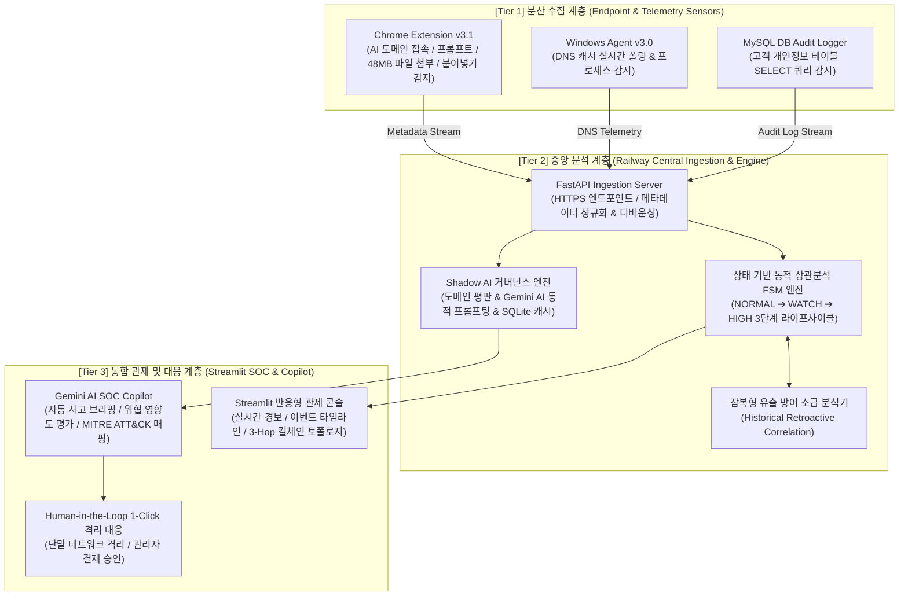
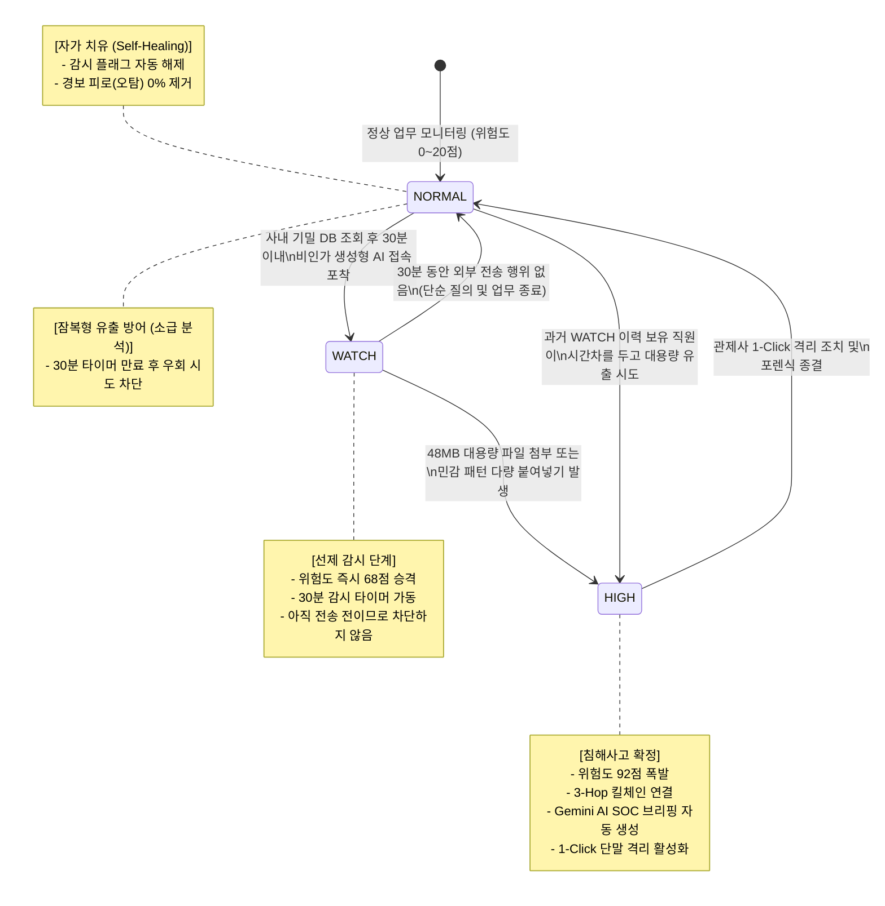
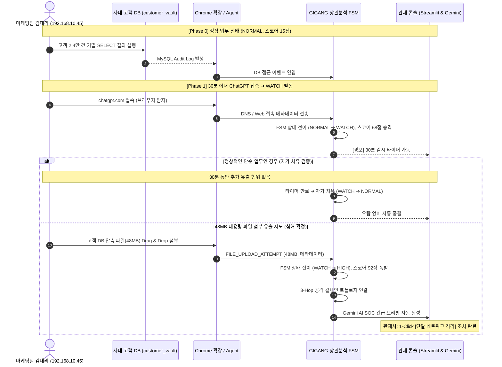

# 🛡️ GIGANG 프로젝트 운영 메커니즘 및 아키텍처 상세 분석 보고서
**Zero Trust 기반 다기종 로그 상관분석 & 섀도우 AI 거버넌스 플랫폼 (v3.1)**

---

## Executive Summary (개요)
현대 기업 환경에서 생성형 AI(ChatGPT, Claude, Gemini 등)의 도입은 임직원의 업무 생산성을 비약적으로 높였으나, 동시에 **사내 기밀 데이터 및 금융·고객 개인정보의 무단 유출(Shadow AI Data Exfiltration)**이라는 심각한 보안 위협을 초래하고 있습니다.

기존 보안 솔루션들은 다음과 같은 구조적 한계에 직면해 있습니다:
1. **기존 SIEM/보안관제 (사후 약방문)**: 로그를 수집하지만 침해 행위가 완료된 후 수십 분~수일 뒤에야 경보를 발생시킵니다.
2. **망분리 및 일괄 차단 DLP (업무 마비 & 피로도)**: 보안을 위해 모든 AI 도메인이나 클라우드 접근을 무조건 차단하여 임직원의 정상 업무를 마비시키거나, 하루 수천 건의 단순 경고를 쏟아내어 보안팀의 경보 피로(Alert Fatigue)를 가중시킵니다.

**GIGANG**은 이러한 문제를 **"업무는 자유롭게, 기밀은 안전하게"**라는 철학 아래, **동적 상태 전이 FSM(Finite State Machine)**과 **3-Hop 인과관계 상관분석**, 그리고 **Google Gemini AI 거버넌스**를 결합하여 해결한 차세대 Zero Trust 보안 분석 시스템입니다.

---

## 1. 시스템 전체 아키텍처 (3-Tier Distributed Architecture)

GIGANG는 엔드포인트 단말 센서부터 클라우드 분석 엔진, 관제 대시보드까지 3계층(3-Tier) 분산 파이프라인으로 구성되어 있습니다.



### 계층별 핵심 역할
1. **Tier 1 (분산 수집 센서)**:
   - **Chrome Extension (Manifest V3)**: 웹 브라우저 내에서 발생하는 AI 사이트(chatgpt.com, claude.ai 등) 접속, 텍스트 붙여넣기(Paste), 대용량 파일 첨부(Drag & Drop, File Upload) 행위를 실시간 감지합니다.
   - **Windows Agent (Python/PyInstaller Native)**: 시스템 네트워크 DNS 캐시를 주기적으로 폴링하여 브라우저 외 단말기 전체의 비인가 아웃바운드 연결을 포착합니다.
   - **Database Audit Logger**: 사내 핵심 기밀 데이터베이스(고객 테이블 등)에 실행되는 대량 SELECT 질의를 실시간 감지하여 중앙 파이프라인으로 전송합니다.
2. **Tier 2 (중앙 인제스천 및 상관분석 엔진)**:
   - Railway 클라우드에 배포된 수집 서버가 이기종 로그를 수집하고 `data/common_schema.json` 형식으로 정규화합니다.
   - 사용자별 상태(NORMAL, WATCH, HIGH)를 추적하는 FSM 기반 상관분석 엔진이 3-Hop 공격 체인을 실시간 엮어냅니다.
3. **Tier 3 (통합 관제 콘솔 및 AI 코파일럿)**:
   - Streamlit 기반의 현대적 UI에서 공격 킬체인 토폴로지를 시각화하고, Gemini AI를 통해 복잡한 위협을 3줄 요약 브리핑으로 변환하여 관제사의 신속한 1-Click 대응을 지원합니다.

---

## 2. 동적 상관분석 FSM 및 3단계 라이프사이클 운영 메커니즘

GIGANG의 가장 핵심적인 기술 차별점은 **단일 이벤트 기반의 단순 탐지(Static Rule)**가 아닌, **시간 흐름과 사용자 행위 인과관계에 따른 동적 상태 전이(Stateful Dynamic Lifecycle)** 메커니즘입니다.



### [Step 1] 선제 감시 (WATCH) 메커니즘
- **조건**: 직원이 사내 고객 개인정보 DB를 조회(`SELECT customer_vault`)한 후, **30분 이내**에 비인가 외부 AI 도메인(`chatgpt.com` 등)에 접속한 경우.
- **동작**:
  - 시스템은 즉시 해당 사용자의 상태를 `NORMAL`에서 `WATCH`로 전이시킵니다.
  - 위험도 스코어를 **68점**으로 선제 격상합니다.
  - 내부 **30분 감시 타이머(Countdown Window)**를 가동합니다.
  - **차별점**: 아직 데이터를 외부로 전송하지 않은 상태이므로 접속을 강제 차단하지 않고 정상 업무를 보장하되, 백그라운드 집중 관찰 대상으로 등록합니다.

### [Step 2] 침해사고 확정 (HIGH) 메커니즘
- **조건**: `WATCH` 상태에 있는 사용자가 브라우저나 단말을 통해 대용량 파일(예: 48MB 압축 파일)을 첨부하거나, 주민등록번호/계좌번호/전화번호 등 민감 패턴이 다수 포함된 텍스트를 대량 붙여넣기(`PASTE`)한 경우.
- **동작**:
  - 즉시 `HIGH` (CRITICAL) 침해 사고로 격상합니다.
  - 위험도 스코어가 **92점**으로 폭발 상승합니다.
  - `[기밀 DB 조회] ➔ [AI 사이트 접속] ➔ [대용량 파일 유출]`의 **3-Hop 인과관계 킬체인**을 확정합니다.
  - Gemini AI SOC Copilot이 관제사 브리핑을 자동 생성하고 1-Click 격리 버튼을 활성화합니다.

### [Step 3] 자가 치유 (Self-Healing) 및 오탐 제거
- **조건**: `WATCH` 상태로 등록된 사용자가 단순 업무 질문만 수행하고 30분 동안 기밀 파일이나 대량 붙여넣기를 수행하지 않은 경우.
- **동작**:
  - 30분 타이머 만료 시 시스템이 스스로 사용자의 상태를 `NORMAL`로 환원합니다.
  - 관제사에게 불필요한 알람을 띄우지 않아 **경보 피로(Alert Fatigue)를 원천 차단**하고 오탐(False Positive)을 완벽히 제거합니다.

### [Step 4] 잠복형 유출 방어 (소급 분석 엔진)
- **우회 공격 방어**: 공격자가 '30분 감시 타이머가 풀릴 때까지 기다렸다가 35분 뒤에 유출하자'고 시도하는 지능적 우회 행위를 차단합니다.
- **동작**: 타이머가 만료되어 `NORMAL`로 돌아간 상태라도, **과거 24시간 내의 WATCH 이력과 DB 접근 이력을 소급 분석(Retroactive Historical Correlation)**하여 지연 전송 행위 역시 즉시 `HIGH`로 격상시킵니다.

---

## 3. 프라이버시 보호 및 본문 미수집 원칙 (Zero Payload Ingestion)

기업 환경에서 단말 감시 솔루션 도입 시 가장 민감한 문제는 **임직원의 사생활 침해 및 기밀 유출 2차 리스크**입니다. GIGANG는 설계 단계부터 철저한 **본문 미수집 원칙(Zero Payload Ingestion)**을 채택했습니다.

| 항목 | 수집 여부 | 처리 방식 |
| :--- | :---: | :--- |
| **붙여넣은 텍스트 본문** | ❌ **절대 수집 안 함** | 단말 브라우저 메모리 상에서 글자 수(예: 3,420자)와 정규식 패턴 개수만 산출 후 폐기 |
| **첨부 파일 원본/내용** | ❌ **절대 수집 안 함** | 파일 크기(바이트, 예: 48,234,496 Bytes), 확장자, MIME 타입만 메타데이터로 추출 |
| **개인 대화 내용** | ❌ **절대 수집 안 함** | 질의 도메인(`chatgpt.com`), 접속 시간, 이벤트 타입(`FILE_UPLOAD_ATTEMPT`)만 기록 |
| **통계 메타데이터** | ✔️ **수집 (최소 전송)** | 전송 바이트 수, 도메인 FQDN, 타임스탬프, 사용자 식별 해시 |

이 설계를 통해 사내 노사 협의 및 개인정보보호법(PIPA/GDPR) 컴플라이언스 이슈를 사전에 완벽히 해소했습니다.

---

## 4. Shadow AI 거버넌스 및 Gemini AI 평가 아키텍처

사내에서 접근하는 수많은 외부 도메인 중 어떤 도메인이 진정한 위협인지를 판단하기 위해 **Google Gemini AI**와 **SQLite 2단계 하이브리드 거버넌스 엔진**을 운영합니다.

```mermaid
flowchart LR
    A["새로운 외부 도메인 접속<br/>(예: unknown-ai-tool.com)"] --> B{"SQLite 캐시 조회<br/>(기존 평가 도메인인가?)"}
    B -->|Hit (캐시 존재)| C["저장된 위험도 스코어 & 카테고리 즉시 반환<br/>(비용 0원, 지연 1ms)"]
    B -->|Miss (신규 도메인)| D["컨텍스트 주입 프롬프트 생성<br/>(도메인 + 사내 누적 트래픽 + 사용자 수)"]
    D --> E{"Gemini API Key 존재 여부"}
    E -->|존재| F["Google Gemini 1.5/2.0 AI 호출<br/>(위협 수준, 데이터 유출 위험성, 카테고리 진단)"]
    E -->|부재/네트워크 오류| G["로컬 룰베이스 Fallback<br/>(사전 정의 키워드 & 휴리스틱 판정)"]
    F --> H["SQLite 캐시 저장 및 관제 콘솔 반영"]
    G --> H
```

### 주요 메커니즘
1. **맥락 기반 동적 프롬프팅 (Context-Aware Prompting)**:
   - 도메인 이름만 AI에 전달하지 않고, **"사내 누적 접속 횟수"**, **"사용자 수"**, **"평균 전송 바이트"** 등 실시간 텔레메트리를 프롬프트에 주입하여 실제 기업 환경에서의 위협 영향도를 정밀 진단합니다.
2. **비용 절감 및 초고속 응답 (Tier-1 SQLite Cache)**:
   - 한 번 평가된 도메인은 로컬 SQLite에 평판 결과가 영구 캐싱되어, 동일 도메인 재접속 시 불필요한 API 호출 비용을 100% 절감하고 즉각적인 응답(1ms)을 보장합니다.
3. **환각(Hallucination) 방지 및 결함 격리 (Graceful Fallback)**:
   - 네트워크 단절이나 API 키 부재 상황에서도 시스템이 중단되지 않고, 로컬 휴리스틱 룰베이스로 자동 전환되어 인시던트 분석의 무중단성을 보장합니다.
4. **Human-in-the-Loop 원칙**:
   - AI는 위험도 분석 및 대응 권고안(SOAR 가이드)을 생성하는 참모 역할을 수행하며, 최종 단말 네트워크 격리나 정책 적용은 반드시 관제사의 승인을 거칩니다.

---

## 5. 실증 시연 시나리오: "마케팅팀 김대리의 48MB 기밀 유출"

GIGANG 플랫폼의 전체 라이프사이클은 실제 공격 시뮬레이션을 통해 100% 검증되었습니다.



---

## 6. 대시보드 화면 및 증적 자료 (Screenshots)

| 번호 | 화면 명칭 | 설명 및 증적 |
| :---: | :--- | :--- |
| **01** | **대시보드 종합 관제** | 실시간 위험도 게이지, 위협 수준별 인시던트 현황, 활성 위협 타임라인 |
| **02** | **3-Hop 킬체인 토폴로지** | `[고객 DB] ➔ [김대리 PC] ➔ [ChatGPT]` 네트워크 홉 시각화 및 상관분석 점수 산출 근거 |
| **03** | **Shadow AI 거버넌스** | 미승인 외부 AI 사이트 목록, Gemini AI 위험도 평가 결과, 데이터 유출 위험 카테고리 |
| **04** | **중앙 텔레메트리 파이프라인** | Chrome 확장, Windows 에이전트, DB 감사 로그 실시간 인입 및 정규화 스트림 |
| **05** | **시연 Step 1: WATCH 모드** | 기밀 DB 조회 후 AI 접속 시 즉시 68점 승격 및 30분 카운트다운 타이머 발동 |
| **06** | **시연 Step 2: HIGH 격상** | 48MB 대용량 파일 첨부 포착 시 92점 폭발 및 Gemini AI SOC 브리핑 자동 연동 |
| **07** | **시연 Step 3: 자가 치유 검증** | 30분 경과 후 추가 전송이 없을 때 스스로 NORMAL로 환원되어 오탐을 완벽히 제거 |

---

## 7. 검증 결과 및 프로젝트 로드맵

### 구현 완료 현황 (Sprint 1 — 100% 완료)
- [x] **Chrome Extension v3.1 MV3**: 프롬프트 길이, 붙여넣기, 48MB 파일 첨부 메타데이터 추출 완료
- [x] **Windows Network Agent 3.0.0**: DNS 캐시 실시간 폴링 및 프로세스 매핑 완료
- [x] **상태 기반 FSM 상관분석 엔진**: 3단계 동적 라이프사이클(NORMAL/WATCH/HIGH) 및 자가 치유 로직 구현
- [x] **잠복형 유출 방어**: 과거 WATCH 이력 소급 분석(Retroactive Correlation) 구현 완료
- [x] **Shadow AI 거버넌스**: Google Gemini AI 연동, SQLite 캐시, Fallback 파이프라인 구축 완료
- [x] **Streamlit 관제 콘솔**: 킬체인 토폴로지, 타임라인, Gemini 브리핑, 1-Click 격리 UI 구현
- [x] **단위 및 통합 테스트**: 20개 시나리오 통합 테스트 전건 PASS 완료

### 향후 고도화 계획 (Sprint 2)
- **실제 네트워크 방화벽 차단 연동**: 관제사가 [격리 조치] 승인 시 Windows Defender 방화벽 및 사내 게이트웨이에 차단 룰 자동 주입
- **실시간 알림 웹훅 연동**: HIGH 등급 인시던트 발생 시 사내 Slack/Teams 채널로 실시간 경보 발송
- **엔터프라이즈 감사 로그 연동**: 대규모 엔터프라이즈 환경을 위한 Kafka/Syslog 스트림 수집기 확장
- **임계값 머신러닝 최적화**: 기업별 업무 특성에 맞춘 동적 스코어링 가중치 자동 튜닝

---
*GIGANG Security Operations Platform — "업무는 자유롭게, 기밀은 안전하게"*
