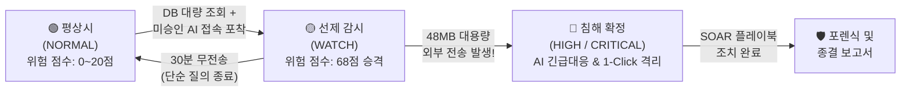

> 💡 **Notion 활용 팁**: 전체 복사(Ctrl + A ➔ Ctrl + C) 후 노션에 붙여넣기(Ctrl + V)하면 최적의 서식으로 자동 변환됩니다.

---

# 2. <시나리오 회의> 위협 모델링 및 탐지 아키텍처 설계

### 📌 회의 개요
| 항목 | 내용 |
| :--- | :--- |
| **일시** | 2026년 8월 21일 (목) 15:00 ~ 19:00 |
| **장소** | Discord 화상 회의실 |
| **참석자** | 팀원 전원 (4명) |
| **회의 목적** | 기업 보안 실무 관점의 트윈 시나리오 정밀화, 오탐 방지 및 예외 처리(TTL, 잠복 유출) 설계 |
| **진행 상태** | `[완료]` 공격/유출 시나리오 2종 및 상관분석 판단 알고리즘 설계 완료 |

---

### 2.1 트윈 시나리오(Twin Scenarios) 정밀 설계

기업 보안을 위협하는 양대 축인 **외부 침투**와 **내부 유출**을 완벽하게 재현하기로 합의했습니다.

#### ⚔️ 시나리오 A: [외부 위협] 계정 탈취 및 내부 측면이동(Lateral Movement) 킬체인
* **공격 흐름**:
  1. 외부 해커가 사내 VPN/웹서버에 5회 연속 로그인 실패 후 무차별 대입(Brute-Force)으로 관리자 계정 탈취
  2. 외부 IP ➔ DMZ 웹서버(:443) 피보팅
  3. 웹서버에서 SSH(:22)를 타고 내부 코어 서버로 횡적이동
  4. 내부 코어 서버에서 금융 고객 DB(`customer_vault`:3306) 비인가 접근
  5. 고객 데이터 2.4만 건 조회 후 외부 C2 서버(:10443)로 158MB 대용량 전송
* **매핑**: MITRE ATT&CK `T1110` (Brute Force) ➔ `T1021` (Remote Services) ➔ `T1005` (Data from Local System)

#### 🛡️ 시나리오 B: [내부 위협] 섀도우 AI 접속 및 기밀 데이터 유출 복합 탐지 (김대리 사건)
* **공격 흐름**:
  1. **[09:00 평상시]**: 마케팅팀 김대리(`kim_marketing`, IP: `192.168.10.45`) 정상 업무 (`NORMAL`)
  2. **[14:00 기밀 조회]**: 하반기 프로모션을 위해 고객 기밀 DB에서 2.4만 건 추출 (`SELECT customer_name, rrn, phone, annual_income FROM customer_vault;`)
  3. **[14:05 AI 접속]**: 미승인 SaaS인 `chatgpt.com`(`api.openai.com`) 접속 ➔ **시스템 선제 감시(`WATCH`, 68점) 자동 승격**
  4. **[14:08 대용량 유출]**: 고객 정보와 전략기획서 압축 파일(48.2MB)을 첨부 업로드 ➔ **침해 확정(`HIGH`, 92점 폭발) 및 인시던트 발령**
  5. **[14:09 SOAR 대응]**: 관제사 1-Click 긴급 대응 (네트워크 격리, DNS 싱크홀 차단, Slack 알림)

---

### 2.2 동적 라이프사이클 및 상관분석(Correlation) 판단 기준

> 📌 **상관분석 판단 기준 (Explainable Scoring Model)**
> 1. **동일 계정/사용자 (+2점)**: 동일한 사내 사용자 식별자에서 발생했는가?
> 2. **동일 IP/서브넷 (+2점)**: 동일한 단말기 또는 로컬 네트워크에서 기인했는가?
> 3. **시간 근접성 (+2점)**: 10~15분 이내의 슬라이딩 윈도우 안에 연속으로 일어났는가?
> 4. **네트워크 홉 연속성 (+2점)**: 이전 이벤트의 `dst_ip`가 다음 이벤트의 `src_ip`로 연결되는가?
> 5. **공격 시퀀스 일치 (+4점)**: 사전 정의된 킬체인 시퀀스와 정밀 부합하는가?
> 
> ⚠️ **오탐 방지 앵커(Anchor) 원칙**: 시간만 가깝다고 묶지 않고, 반드시 `동일 계정` 또는 `네트워크 홉 연속성`이 1개 이상 존재할 때만 결합하여 오결합(Over-grouping) 원천 방지.

---

### 2.3 예외 처리 및 방어 논리 (심사위원 질문 대비 필살기)

<aside>
🌿 <b>오탐 자가 치유 (Self-Healing TTL)</b> 
김대리가 DB를 본 뒤 단순 영어 이메일 문법 하나만 질문하고 껐다면? 시스템은 30분 타이머(TTL)를 가동하여 30분 동안 대용량 전송이 없으면 관제사 개입 없이 자동으로 <code>🟢 NORMAL</code> 상태로 원복 청소합니다. (경보 피로 Alert Fatigue 해결)
</aside>

<aside>
🥷 <b>잠복형 유출 (Dormant Exfiltration) 추적</b> 
30분이 지나 NORMAL로 풀리는 것을 악용하여 3시간 뒤 야간에 기습적으로 대용량 전송을 시도한다면? GIGANG는 단말의 24시간 DB 누적 감사 히스토리를 대조하여 단독 아웃바운드 급증 이벤트를 즉각 최고 위험도(HIGH/CRITICAL)로 재승격합니다.
</aside>

---

### 2.4 회의 결정 사항 및 즉시 실천 과제 (Action Items)
- [x] 시나리오 A(외부 침투) 및 B(김대리 유출) 시퀀스 확정
- [x] 정상 복구(TTL 30분) 및 잠복 유출(Dormant) 알고리즘 로직 명세화
- [x] 공통 데이터 스키마 설계를 위한 표준 JSON 필드 정리

---
