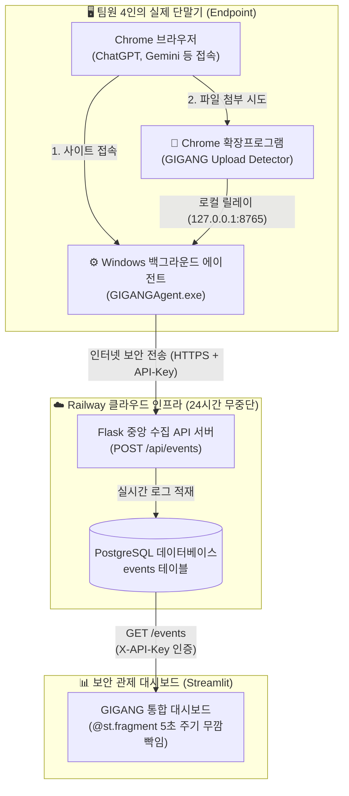

# 💡 <아이디어 수정 회의> Railway 클라우드 구축 및 하이브리드 파이프라인 피보팅

> 💡 **Notion 활용 팁**: 본 마크다운을 복사(`Ctrl + C`)하여 노션 페이지에 붙여넣기(`Ctrl + V`)하면 **콜아웃, 표, 코드 블록, 인포그래픽 다이어그램, 체크리스트**가 완벽한 노션 컴포넌트로 자동 변환됩니다.

---

### 📌 회의 개요
| 항목 | 내용 |
| :--- | :--- |
| **일시** | 2026년 9월 2일 (수) 15:00 ~ 18:30 |
| **장소** | 캡스톤 프로젝트 실습실 & Discord 회의실 |
| **참석자** | 팀원 전원 (4명: 인프라/수집, 파서/정규화, 상관분석/AI, 대시보드/SOAR) |
| **회의 목적** | 더미 데이터 및 로컬 관제의 한계 인식, **Railway 클라우드 수집 서버 도입에 따른 기획 피보팅(아이디어 수정)** 및 하이브리드 관제 아키텍처 확립 |
| **진행 상태** | `[완료]` 실단말 라이브 수집 체계 전환, AI 거버넌스 양성화 기능 승격, 단일 API 분업 체계 합의 완료 |

---

### 1. 배경: 기존 초기 기획의 4대 현실적 한계와 위기 봉착

1차 공식 회의(8/25) 이후 1~2주차 개발을 진행하면서, 팀은 초기 기획했던 **"정적 더미 로그 기반 SIEM 관제"**가 캡스톤 최종 평가 및 실무 관점에서 치명적인 결함이 있음을 발견했습니다.

```
[초기 기획의 4대 치명적 한계]
1. 정적 더미 데이터의 설득력 한계 ➔ "이게 진짜 제로 트러스트인가? 그냥 가짜 CSV 재생 아닌가?"
2. 단순 DNS/웹 접속의 맹점 ➔ chatgpt.com에 들어갔다고 해서 기밀을 유출했는지 일반 검색인지 판별 불가
3. 로컬 파일 취합의 병목 ➔ 4명 팀원의 단말 로그를 카카오톡이나 파일로 주고받는 것은 실시간 관제 불가
4. Vercel Stlite(WASM)의 기술적 한계 ➔ 브라우저 샌드박스 내부에서 돌아 백그라운드 소켓 수집 데몬 실행 불가
```

| 검토 영역 | 초기 기획 (AS-IS) | 현실적 한계 및 문제점 |
| :--- | :--- | :--- |
| **데이터 소스** | 사전 정의된 정적 더미 CSV 파일 | 시연 시 신뢰도 급감 ("녹화된 비디오 틀어주는 것과 다를 바 없음") |
| **행위 판별력** | 단순 웹/DNS 접근 이벤트 (`WEB_ACCESS`) | 접속 사실만 알 뿐, **실제 파일 첨부/데이터 업로드 시도 여부 증명 불가** |
| **데이터 유통** | 각자 PC 로컬 저장 및 수동 복사 | 팀원 간 실시간 데이터 동기화 불가능, 데이터 병목 발생 |
| **배포 환경** | Vercel Stlite (WebAssembly 기반) | 브라우저 샌드박스 내부 제약으로 외부 통신 및 항시 수집 소켓 차단 |

> ⚠️ **팀 내 위기 의식 공유**:  
> *"심사위원 앞에서 '저희는 실시간 제로 트러스트 관제 시스템입니다'라고 말하려면, **지금 이 순간 발표장 PC에서 일어나는 브라우징과 업로드 행위가 화면에 라이브로 찍혀야 한다.** 정적 더미 데이터만으로는 A+를 받을 수 없다!"*

---

### 2. 전환점: Railway 클라우드 서버 구축 및 2-Tier 실시간 수집 인프라 신설

인프라 담당 팀원이 주도하여 24시간 중단 없이 인터넷상에서 라이브 로그를 수신할 수 있는 **Railway 클라우드 백엔드 인프라를 긴급 구축**하면서 기획 수정의 기술적 발판이 마련되었습니다.

#### 🏗️ 구축된 신규 인프라 구성도



#### 🛠️ 도입된 핵심 수집 컴포넌트 규격
1. **중앙 클라우드 서버**: Railway 상에 Flask REST API와 PostgreSQL DB를 연동하여 `https://bountiful-nature-production-22ec.up.railway.app/events` 상시 가동.
2. **단말 에이전트 (`GIGANGAgent.exe`)**: 각 팀원 PC 백그라운드에서 실행되어 활성 사이트 접속(`WEB_ACCESS`)을 실시간 캡처.
3. **Chrome 브라우저 확장프로그램 (`Upload Detector`)**: 브라우저 DOM 레벨에서 파일 드래그앤드롭 및 `<input type="file">` 첨부 행위를 가로채 `FILE_UPLOAD_ATTEMPT` 로그를 로컬 에이전트로 릴레이.
4. **보안 체계**: API Key(`20110313`) 및 외부 접속 주소는 코드에 하드코딩하지 않고 `.env` 환경 변수(`RAILWAY_API_KEY`)로 격리.

---

### 3. 아이디어 수정(Pivot) 핵심 결정 사항 (3대 전환)

Railway 서버 구축을 계기로, 팀은 프로젝트의 정체성을 **"단순 모의 관제"**에서 **"실환경 라이브 트래픽 기반 하이브리드 거버넌스 플랫폼"**으로 전격 수정하기로 합의했습니다.

#### 🔄 수정 1: "더미 데이터 단독 관제" ➔ "하이브리드(Hybrid) 관제 아키텍처"로 전환
* **결정 내용**:
  * 팀원 4명의 실제 PC에서 실시간 수집되는 **라이브 트래픽(실제 수집된 63개 도메인 접속 현황)**을 바탕 레이어로 사용.
  * 여기에 외부 해커의 피보팅 침투 및 김대리의 48MB 대용량 유출 등 **10대 인시던트 위협 시나리오를 교차 합성**.
* **효과**: 발표 시 팀원이 자기 노트북에서 실제로 브라우저를 켜거나 파일을 첨부하면 관제 화면에 5초 이내로 감지 로그가 찍히는 압도적인 **'라이브 시연 현장감'** 확보.

#### 🔄 수정 2: "단순 접속 차단" ➔ "섀도우 AI 거버넌스(양성화 관리)"로 기획 확장 (3과목 킬러 기능)
* **결정 내용**:
  * 초기에는 "미승인 AI 사이트는 방화벽으로 무조건 막는다"는 단순 접근이었으나, 이는 현업 부서의 업무 생산성을 저해하여 현실성이 떨어짐.
  * **"조건부 승인 및 양성화 프로세스"**를 도입하여, Google Gemini AI가 실시간으로 해당 도메인의 *'LLM 학습 데이터 재활용 위험도'*를 분석하고, 보안 관리자가 UI에서 **"승인(Approved)" / "차단(Blocked)"**을 즉각 결정할 수 있는 양성화 거버넌스 파이프라인으로 승격.
* **효과**: SKT ALEPH 3과목(접근통제 및 거버넌스)의 비중을 획기적으로 강화하고, 단순 SIEM을 뛰어넘는 비즈니스 친화적 보안 솔루션으로 탈바꿈.

#### 🔄 수정 3: 대시보드 내 "중앙 서버 파이프라인 전용 모니터링 탭" 신설
* **결정 내용**:
  * 수집된 Railway 라이브 데이터를 관리자가 한눈에 검증할 수 있도록 대시보드 최상단에 **[중앙 서버 파이프라인]** 인터랙티브 데이터 테이블 신설.
  * 전체 페이지가 리프레시되는 깜빡임 현상을 방지하기 위해 Streamlit의 최신 **`@st.fragment(run_every="5s")`** 데코레이터를 적용하여 무깜빡임 실시간 스트리밍 구현.

---

### 4. 팀원 간 분업 및 협업 방식의 혁신적 간소화

Railway 중앙 서버와 `/events` API의 등장으로 팀원 간의 복잡한 연동 절차가 획기적으로 단순화되었습니다.

```python
# [팀원 공유용 실제 로그 연동 표준 코드]
import os, requests

url = "https://bountiful-nature-production-22ec.up.railway.app/events"
headers = {"X-API-Key": os.getenv("RAILWAY_API_KEY")}

response = requests.get(url, headers=headers, timeout=5)
live_logs = response.json()  # ➔ 기존 UI의 더미 데이터 자리에 그대로 대입!
```

* **수집 테스트 담당자**: 복잡한 환경 설정 없이 `GIGANGAgent.exe` 더블 클릭 + Chrome 확장프로그램 로드만으로 즉시 실데이터 생성 기여.
* **UI/분석 담당자**: 백엔드 DB 구조를 알 필요 없이, `GET /events` API 호출 한 줄로 실제 4대 PC의 라이브 로그를 Streamlit UI에 즉시 바인딩.
* **팀 문서화 가이드 즉시 배포**: 비개발/타 파트 팀원도 1분 만에 에이전트를 켤 수 있도록 `GIGANG_팀원공유_초간단가이드.md` 작성 및 슬랙 공유.

---

### 5. 회의 결정 사항 및 즉시 실천 과제 (Action Items)

- [x] Railway 수집 서버 배포 및 PostgreSQL `events` 테이블 스키마 초기화 완료
- [x] 팀원 배포용 `GIGANGAgent.exe` 및 `Chrome Upload Detector` 빌드 완료
- [x] 비전공/협업 팀원을 위한 `GIGANG_팀원공유_초간단가이드.md` 배포
- [x] Streamlit 대시보드에 `team_collector.py` 모듈 생성 및 `@st.fragment` 5초 자동 갱신 탭 구현
- [x] Gemini AI 연동 실시간 미등록 도메인 즉시 진단기 및 거버넌스 승인/차단 상태 머신 구현 착수
- [x] 다음 2차 공식 회의(중간 점검) 전까지 라이브 수집 로그 50건 이상 확보 및 시연 리허설 준비

---

> 📅 **차기 회의 일정**: 2026년 9월 8일 (화) 16:00 (제2차 공식 회의: 중간 개발 성과 보고 및 트러블슈팅)
