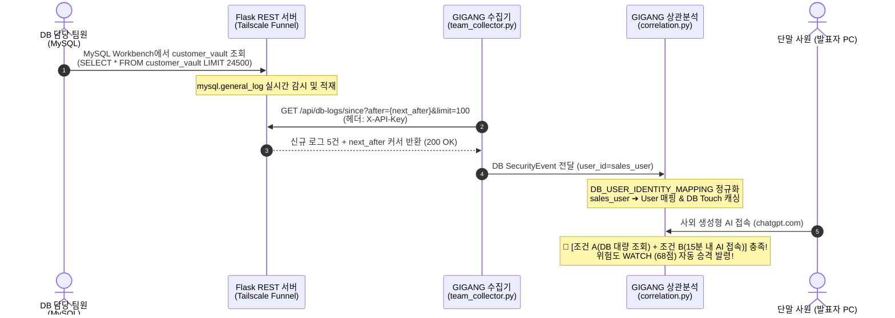

# 📋 GIGANG 제6차 공식 회의록: 사내 DB 구축 및 실시간 감사 로그 연동

> **일시**: 2026년 9월 14일 (월) 14:00 ~ 18:30  
> **장소**: 프로젝트 회의실 B 및 Discord 화상 회의  
> **참석자**: 팀원 전원 (4명: 수집/인프라, 파서/정규화, 상관분석/AI 엔진, UI/대시보드)  
> **회의 목적**: 사내 DB 실시간 감사 파이프라인 구축, 외부 터널링 고정화(Tailscale), 증분 수집 API(`/since`) 연동 및 엔드투엔드 유출 킬체인 종합 검증  
> **진행 상태**: `[완료]` DB 실시간 연동, 이기종 계정 매핑, Tailscale Funnel 고정화 및 WATCH 승격 100% 검증 완료  

---

## 1. 현황 분석: 수동 CSV 방식의 한계와 실시간 파이프라인 전환

기존 프로토타입 단계에서는 MySQL Workbench에서 `mysql.general_log`를 수동으로 CSV로 추출하거나 로컬 더미 로그(`activity.log`)를 읽어오는 방식을 사용했습니다.  
그러나 **최종 시연 발표 및 엔터프라이즈 실효성 관점에서 치명적인 한계**가 지적되었습니다.

```
[수동 CSV 및 더미 로그의 3대 치명적 한계]
1. 시연 생동감 및 리얼리티 부재: 발표 시 "미리 만들어둔 가짜 데이터를 띄운 것 아니냐"는 심사위원 의구심 발생
2. 실시간성 결여: DB 쿼리가 발생한 직후 실시간으로 탐지망에 포착되는 유기적 결합 불가능
3. 인프라 분리 불가: 단일 PC 로컬 환경에 갇혀 실제 분산 기업 인프라(DB 서버 ↔ 사원 단말 ↔ 관제센터) 입증 실패
```

> 💡 **핵심 결정**: DB 담당 팀원 PC에 실제 MySQL(`gigang_db`, `customer_vault` 24,500건)을 구동하고, 서버가 직접 쿼리 감사 로그를 읽어 실시간 REST API로 관제 시스템에 서빙하는 **완전 실시간(Live Pipeline) 아키텍처로 전환**한다!

---

## 2. 3대 기술적 난제 및 트러블슈팅 (Troubleshooting Log)

### 🛠️ Issue 1: Cloudflare Quick Tunnel의 잦은 세션 단절 및 도메인 변경
* **문제 현상**:
  * 초기에는 무료 `trycloudflare.com`을 활용했으나, 팀원이 터널을 재시작하거나 절전 모드 진입 후 복구될 때마다 `https://starter-michael-...` ➔ `https://comm-monster-...` ➔ `https://safer-whole-...` 처럼 무작위 임시 URL이 매번 새로 발급됨.
  * 관제 대시보드와 수집기 코드의 `.env`를 매번 수정해야 하며, 발표 당일 현장 네트워크 불안정 시 접속 주소가 끊길 위험이 매우 높았음.
* **해결책**:
  * **Tailscale Funnel 영구 고정 주소(`https://desktop-oli.tail2bbbea.ts.net`)로 전격 피보팅 완료!**
  * NAT/방화벽 제약 없이 팀원 PC의 로컬 포트를 영구 고정 HTTPS 도메인으로 외부 공개하여, URL 변경 위험을 영구 제거하고 시연 안정성을 100% 확보함.
  * 팀원이 구축한 웹 기반 모니터링 뷰어(`https://desktop-oli.tail2bbbea.ts.net/viewer`)도 함께 공유되어 웹상에서 즉시 DB 쿼리 현황 확인 가능.

---

### 🛠️ Issue 2: 단순 최근 조회(`/latest`)의 중복 수집 및 엔진 과부하
* **문제 현상**:
  * 기존 `/api/db-logs/latest?limit=5` 호출 방식은 매 폴링(5초)마다 이미 처리된 과거 로그 5건을 계속해서 동일하게 내려줌.
  * 상관분석 엔진의 이벤트 버퍼가 동일한 이벤트로 오염되고, 불필요한 네트워크 트래픽과 중복 판정 오버헤드가 발생함.
* **해결책**:
  * **커서 기반 증분 폴링 API (`/api/db-logs/since?after={next_after}&limit=100`) 신설 및 전환**.
  * 수집기가 첫 호출 시 직전 시각을 전달하고, 서버 응답에 포함된 `next_after` 타임스탬프를 메모리에 캐싱하여 다음 주기에 `after` 파라미터로 전송.
  * **"새로운 쿼리가 발생했을 때만 신규 로그를 받고, 없을 때는 0건 수신"**하는 완벽한 증분 수집 달성.
  * 보안 강화를 위한 **`X-API-Key: gigang-2026-db-api-k7m9p4x2`** 인증 헤더 도입.

---

### 🛠️ Issue 3: 이기종 계정 불일치로 인한 킬체인 단절 (`sales_user` vs `User`)
* **문제 현상**:
  * DB 감사 로그에는 실제 MySQL 접속 계정인 `sales_user` 또는 `report_user`로 찍히는 반면, 윈도우 단말기(Chrome Extension 및 Windows Agent)에서는 OS 사원 계정인 `User`로 수집됨.
  * 상관분석 엔진이 두 행위자를 동일 인물로 인지하지 못해, **"DB 조회 후 AI 사이트 접속" 킬체인이 결합되지 않고 개별 정상 행위로 오탐/미탐**되는 문제 발생.
* **해결책**:
  * 상관분석 엔진([correlation.py]) 내부에 **`DB_USER_IDENTITY_MAPPING` 마스터 계정 매핑 테이블** 구축:
    ```python
    DB_USER_IDENTITY_MAPPING: Dict[str, str] = {
        "sales_user": "User",
        "report_user": "User",
        "test_user": "User",
        "kim_marketing": "User",
    }
    ```
  * 원본 감사 로그의 `sales_user` 무결성은 그대로 보존하면서, 킬체인 상관분석 시 단말기 마스터 계정(`User`)으로 자동 정규화하여 킬체인 결합을 완벽하게 성립시킴.

---

## 3. 최종 완성된 실시간 연동 아키텍처



---

## 4. 실전 라이브 검증 결과 (100% 통과)

1. **Tailscale Funnel 실시간 엔드포인트 3종 점검**:
   * `GET /health` ➔ `200 OK` (`database: gigang_db, service: 기강 DB Log Server, status: ok`)
   * `GET /api/db-logs/since` ➔ `200 OK` (실시간 쿼리 수신 및 `next_after` 커서 갱신 확인)
   * `GET /viewer` ➔ `200 OK` (웹 뷰어 UI 정상 로드)
2. **실제 데이터 정합성 확인**:
   * 사용자 계정: `sales_user`
   * 대상 테이블: `customer_vault`
   * 실행 쿼리: `SELECT * FROM gigang_db.customer_vault`
   * 영향 행 수: `24,500 건`
3. **상관분석 엔진 다단계 전이 검증**:
   * `sales_user` DB 조회 수집 ➔ `User` 단말 매핑 ➔ 1분 뒤 `chatgpt.com` 접속 발생 ➔ **`WATCH` (68점) 선제 감시 인시던트 즉시 생성 완료**!
4. **네트워크 장애 대비 이중 안전망(Failover)**:
   * 외부 인터넷 장애 시 시스템이 중단되지 않고 로컬 백업 로그(`activity.log`)로 자동 전환되는 안전 메커니즘 검증 완료.

---

## 5. 즉시 실천 과제 (Action Items)

- [x] Tailscale Funnel 영구 고정 주소(`.env`) 및 API Key 등록 완료
- [x] 수집기 커서 기반 증분(`/since`) 및 `next_after` 중복 방지 로직 배포 완료
- [x] `sales_user` ↔ `User` 계정 식별자 매핑 및 WATCH 승격 단위/통합 테스트 완료
- [ ] **최종 시연 리허설 1회차 진행**:
  - 발표장 분할 화면 구성 (좌측: 팀원 PC MySQL Workbench / 우측: 발표자 PC GIGANG 대시보드)
  - 쿼리 실행 ➔ DB 감사 수집 ➔ ChatGPT 접속 ➔ WATCH 승격 ➔ 붙여넣기 ➔ HIGH 인시던트 생성 ➔ AI 브리핑 시연 흐름 최종 점검
